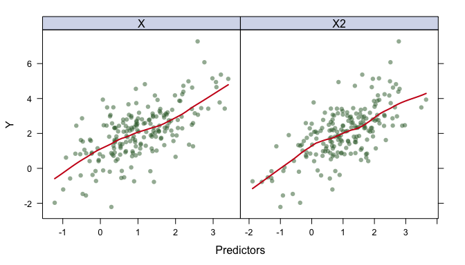
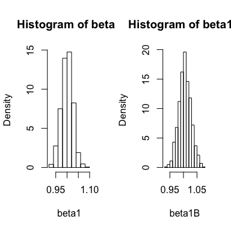

Cross-validation and Bootstrapping
================

``` r
library(caret)
library(boot)
```

Cross-validation
================

You can generate a simulated training dataset or use an existing dataset. For illustration, we use a simulated dataset with two predictors.

``` r
# Generate the data, you can replace this with your own function
gen_data <- function(N)
{
  X <- rnorm(N, mean = 1)
  X2 <- rnorm(N, mean = 1)
  eps <- rnorm(N, sd = .5)
  Y <- X + X2 + eps
  data.frame(Y = Y, X = X, X2 = X2)
}

set.seed(1)
# generate training data
N <- 200
trainData <- gen_data(N)
```

The function `featurePlot()` in `caret` is a wrapper for different lattice plots to visualize the data. The various graphical parameters (color, line type, background, etc) that control the look of Trellis displays are highly customizable. You can explore `trellis.par.set()` after class.

``` r
theme1 <- trellis.par.get()
theme1$plot.symbol$col <- rgb(.2, .4, .2, .5)
theme1$plot.symbol$pch <- 16
theme1$plot.line$col <- rgb(.8, .1, .1, 1)
theme1$plot.line$lwd <- 2
theme1$strip.background$col <- rgb(.0, .2, .6, .2)

trellis.par.set(theme1)
featurePlot(x = trainData[,(2:3)], 
            y = trainData[,1], 
            plot = "scatter",  # you can use pairs
            labels = c("Predictors","Y"),
            type = c("p", "smooth"),
            span = .5, # controls the smoothness of the curve
            layout = c(2, 1))
```



### The validation set approach

The function `createDataPartition()` creates test/training or test/validation partitions.

``` r
trRows <- createDataPartition(trainData$Y, times = 1, # This the number of partitions
                              p = .50,
                              list = FALSE)

fit_tr <- lm(Y~., data = trainData[trRows,])

pred_va <- predict(fit_tr, trainData[-trRows,])

# validation set error
mean((pred_va-trainData$Y[-trRows])^2)
```

    ## [1] 0.2832969

### K-fold CV

#### Approach 1

The function `createFolds()` splits the data into k groups. `returnTrain = TRUE` means the values returned are the sample positions corresponding to the data used during training.

``` r
cvSplits <- createFolds(trainData$Y, 
                        k = 10, 
                        returnTrain = TRUE)

str(cvSplits)
```

    ## List of 10
    ##  $ Fold01: int [1:180] 1 2 3 4 5 6 7 8 9 10 ...
    ##  $ Fold02: int [1:180] 1 3 5 6 7 9 10 11 12 13 ...
    ##  $ Fold03: int [1:180] 1 2 3 4 5 6 7 8 9 10 ...
    ##  $ Fold04: int [1:180] 2 3 4 5 6 7 8 9 10 11 ...
    ##  $ Fold05: int [1:180] 1 2 3 4 5 6 7 8 9 10 ...
    ##  $ Fold06: int [1:180] 1 2 3 4 5 6 7 8 9 10 ...
    ##  $ Fold07: int [1:180] 1 2 3 4 7 8 11 12 13 14 ...
    ##  $ Fold08: int [1:180] 1 2 3 4 5 6 8 9 10 11 ...
    ##  $ Fold09: int [1:180] 1 2 4 5 6 7 8 9 10 11 ...
    ##  $ Fold10: int [1:180] 1 2 3 4 5 6 7 8 9 10 ...

Calculate the cross-validation MSE for model 1 (`Y~X`) and model 2 (`Y~X+X2`).

``` r
K <- 10
mseK1 <- rep(NA, K)
mseK2 <- rep(NA, K)

for (k in 1:K)
{
  trRows <- cvSplits[[k]]
  
  fit_tr1 <- lm(Y~X, data = trainData[trRows,])
  mseK1[k] <- mean((predict(fit_tr1, trainData[-trRows,]) - trainData$Y[-trRows])^2)
  
  fit_tr2 <- lm(Y~X+X2, data = trainData[trRows,])
  mseK2[k] <- mean((predict(fit_tr2, trainData[-trRows,]) - trainData$Y[-trRows])^2)
}
# K-fold MSE
c(mean(mseK1), mean(mseK2))
```

    ## [1] 1.2999005 0.2953515

#### Approach 2 (recommended)

Calculate the 10-fold CV MSE using the function `train()`.

``` r
# 10-fold CV
ctrl1 <- trainControl(method = "cv", number = 10)

# other options
ctrl2 <- trainControl(method = "LOOCV")
ctrl3 <- trainControl(method = "none") # only fits one model to the entire training set
ctrl4 <- trainControl(method = "boot632")
ctrl5 <- trainControl(method = "repeatedcv", repeats = 5) 
ctrl6 <- trainControl(method = "LGOCV") 

set.seed(1)
lmFit2 <- train(Y~., 
                data = trainData, 
                method = "lm", 
                trControl = ctrl1)
lmFit2
```

    ## Linear Regression 
    ## 
    ## 200 samples
    ##   2 predictor
    ## 
    ## No pre-processing
    ## Resampling: Cross-Validated (10 fold) 
    ## Summary of sample sizes: 180, 180, 180, 180, 180, 180, ... 
    ## Resampling results:
    ## 
    ##   RMSE       Rsquared   MAE      
    ##   0.5377104  0.8719125  0.4321413
    ## 
    ## Tuning parameter 'intercept' was held constant at a value of TRUE

``` r
set.seed(1)
lmFit1 <- train(Y~X, 
                data = trainData,
                method = "lm", 
                trControl = ctrl1)
lmFit1
```

    ## Linear Regression 
    ## 
    ## 200 samples
    ##   1 predictor
    ## 
    ## No pre-processing
    ## Resampling: Cross-Validated (10 fold) 
    ## Summary of sample sizes: 180, 180, 180, 180, 180, 180, ... 
    ## Resampling results:
    ## 
    ##   RMSE     Rsquared   MAE      
    ##   1.13072  0.4156934  0.8949097
    ## 
    ## Tuning parameter 'intercept' was held constant at a value of TRUE

To compare these two models based on their cross-validation statistics, the `resamples()` function can be used with models that share a common set of resampled data sets.

``` r
resamp <- resamples(list(lm1 = lmFit1, lm2 = lmFit2))
summary(resamp)
```

    ## 
    ## Call:
    ## summary.resamples(object = resamp)
    ## 
    ## Models: lm1, lm2 
    ## Number of resamples: 10 
    ## 
    ## MAE 
    ##          Min.   1st Qu.    Median      Mean   3rd Qu.      Max. NA's
    ## lm1 0.7004659 0.8662645 0.8995057 0.8949097 0.9237237 1.0446051    0
    ## lm2 0.3630479 0.3972755 0.4210815 0.4321413 0.4497654 0.5604048    0
    ## 
    ## RMSE 
    ##          Min.   1st Qu.    Median      Mean   3rd Qu.      Max. NA's
    ## lm1 0.8427472 1.0906371 1.1611404 1.1307203 1.1855606 1.3131807    0
    ## lm2 0.4758600 0.4925024 0.5104181 0.5377104 0.5617783 0.7246342    0
    ## 
    ## Rsquared 
    ##          Min.   1st Qu.    Median      Mean   3rd Qu.      Max. NA's
    ## lm1 0.1868833 0.2480541 0.4462213 0.4156934 0.5768211 0.6106576    0
    ## lm2 0.7735242 0.8338008 0.8940522 0.8719125 0.9117475 0.9202730    0

``` r
modelDifferences <- diff(resamp) # The is doing paired t test to see if they are different
summary(modelDifferences)
```

    ## 
    ## Call:
    ## summary.diff.resamples(object = modelDifferences)
    ## 
    ## p-value adjustment: bonferroni 
    ## Upper diagonal: estimates of the difference
    ## Lower diagonal: p-value for H0: difference = 0
    ## 
    ## MAE 
    ##     lm1       lm2   
    ## lm1           0.4628
    ## lm2 7.224e-07       
    ## 
    ## RMSE 
    ##     lm1       lm2  
    ## lm1           0.593
    ## lm2 5.308e-07      
    ## 
    ## Rsquared 
    ##     lm1       lm2    
    ## lm1           -0.4562
    ## lm2 5.901e-06

Bootstrapping
=============

Estimate distribution of $\\widehat{\\beta}\_{1}$ by resampling from the true population (if you know the truth!).

``` r
N <- 400
trainData <- gen_data(N)
B <- 1000
beta1 <- rep(NA, B)
for(b in 1:B)
{
  fitb <- lm(Y~., data = gen_data(N))
  beta1[b] <- fitb$coef[2]
}
sd(beta1)
```

    ## [1] 0.02484926

### Bootstrap using a for loop

``` r
beta1B <- rep(NA, B)
for(b in 1:B)
{
  ind <- sample(1:N, size = N, replace = TRUE)
  datab <- trainData[ind,]
  fitb <- lm(Y~., data = datab)
  beta1B[b] <- fitb$coef[2]
}
sd(beta1B)
```

    ## [1] 0.02226179



### Bootstrap using boot()

``` r
fun <- function(data, ind) 
# The first argument passed will be the original data
# The second will be a vector of indices that define the bootstrap sample
{
  data2 <- data[ind,]
  fit <- lm(Y~., data = data2)
  fit$coef[2]
}


beta1_boot <- boot(trainData, statistic = fun, R = 1000)
sd(beta1_boot$t)
```

    ## [1] 0.02179198
