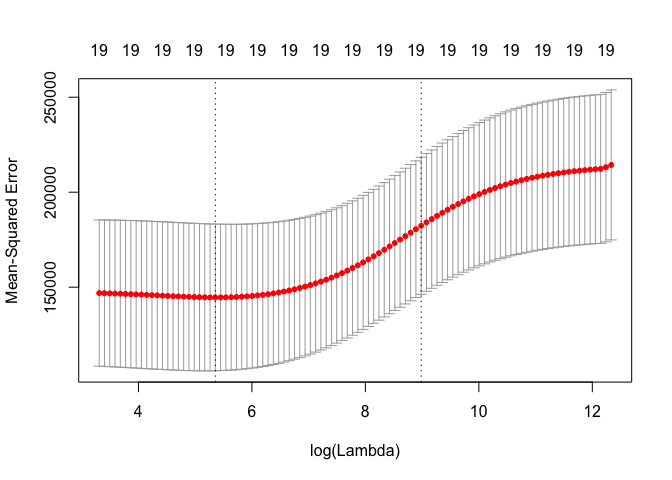
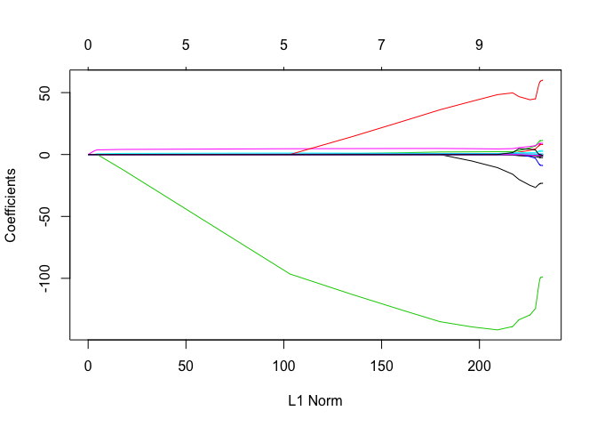
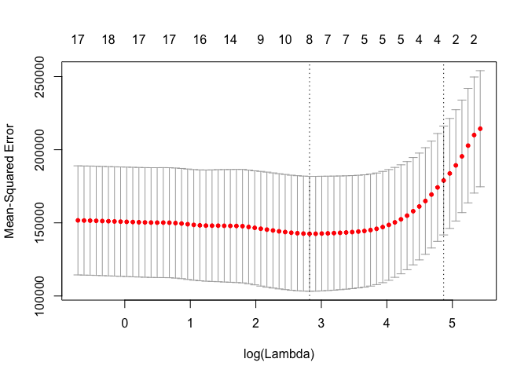

Ridge Regression & the Lasso
================
Amin Yakubu
2/21/2019

``` r
library(ISLR)
library(tidyverse)
```

    ## ── Attaching packages ──────────────────────────────────────────────────────────────────────────────────────── tidyverse 1.2.1 ──

    ## ✔ ggplot2 3.1.0     ✔ purrr   0.2.5
    ## ✔ tibble  1.4.2     ✔ dplyr   0.7.8
    ## ✔ tidyr   0.8.1     ✔ stringr 1.3.1
    ## ✔ readr   1.1.1     ✔ forcats 0.3.0

    ## ── Conflicts ─────────────────────────────────────────────────────────────────────────────────────────── tidyverse_conflicts() ──
    ## ✖ dplyr::filter() masks stats::filter()
    ## ✖ dplyr::lag()    masks stats::lag()

Ridge Regression and the Lasso
==============================

We will use the glmnet package in order to perform ridge regression and the lasso. We will now perform ridge regression and the lasso in order to predict Salary on the Hitters data.

``` r
data("Hitters")
# Checking for missing values
sum(is.na(Hitters$Salary))
```

    ## [1] 59

``` r
# removing missing values
Hitters = na.omit(Hitters)
sum(is.na(Hitters))
```

    ## [1] 0

We must pass in an x matrix as well as a y vector, and we do not use the y ∼ x syntax

``` r
x = model.matrix(Salary ~., Hitters)[,-1] 
y = Hitters$Salary
```

The model.matrix() function is particularly useful for creating x; not only does it produce a matrix corresponding to the 19 predictors but it also automatically transforms any qualitative variables into dummy variables. The latter property is important because glmnet() can only take numerical, quantitative inputs.

Ridge Regression
----------------

The glmnet() function has an alpha argument that determines what type of model is fit. If alpha=0 then a ridge regression model is fit, and if alpha=1 then a lasso model is fit. We first fit a ridge regression model.

``` r
library(glmnet)
```

    ## Loading required package: Matrix

    ## 
    ## Attaching package: 'Matrix'

    ## The following object is masked from 'package:tidyr':
    ## 
    ##     expand

    ## Loading required package: foreach

    ## 
    ## Attaching package: 'foreach'

    ## The following objects are masked from 'package:purrr':
    ## 
    ##     accumulate, when

    ## Loaded glmnet 2.0-16

``` r
grid = 10 ^ seq(10,-2, length = 100)

ridge.mod = glmnet(x, y, alpha = 0, lambda = grid)
```

By default the glmnet() function performs ridge regression for an automatically selected range of λ values. However, here we have chosen to implement the function over a grid of values ranging from λ = 1010 to λ = 10^−2, essentially covering the full range of scenarios from the null model containing only the intercept, to the least squares fit. As we will see, we can also com- pute model fits for a particular value of λ that is not one of the original grid values. Note that by default, the glmnet() function standardizes the variables so that they are on the same scale. To turn off this default setting, use the argument standardize=FALSE.

Associated with each value of λ is a vector of ridge regression coefficients, stored in a matrix that can be accessed by coef(). In this case, it is a 20×100 matrix, with 20 rows (one for each predictor, plus an intercept) and 100 columns (one for each value of λ).

``` r
dim(coef(ridge.mod))
```

    ## [1]  20 100

We expect the coefficient estimates to be much smaller, in terms of L2 norm, when a large value of λ is used, as compared to when a small value of λ is used. These are the coefficients when λ = 11,498, along with their l2 norm:

``` r
ridge.mod$lambda[50]
```

    ## [1] 11497.57

``` r
coef(ridge.mod)[,50]
```

    ##   (Intercept)         AtBat          Hits         HmRun          Runs 
    ## 407.356050200   0.036957182   0.138180344   0.524629976   0.230701523 
    ##           RBI         Walks         Years        CAtBat         CHits 
    ##   0.239841459   0.289618741   1.107702929   0.003131815   0.011653637 
    ##        CHmRun         CRuns          CRBI        CWalks       LeagueN 
    ##   0.087545670   0.023379882   0.024138320   0.025015421   0.085028114 
    ##     DivisionW       PutOuts       Assists        Errors    NewLeagueN 
    ##  -6.215440973   0.016482577   0.002612988  -0.020502690   0.301433531

In contrast, here are the coefficients when λ = 705, along with their l2 norm. Note the much larger l2 norm of the coefficients associated with this smaller value of λ

``` r
ridge.mod$lambda[60]
```

    ## [1] 705.4802

``` r
coef(ridge.mod)[,60]
```

    ##  (Intercept)        AtBat         Hits        HmRun         Runs 
    ##  54.32519950   0.11211115   0.65622409   1.17980910   0.93769713 
    ##          RBI        Walks        Years       CAtBat        CHits 
    ##   0.84718546   1.31987948   2.59640425   0.01083413   0.04674557 
    ##       CHmRun        CRuns         CRBI       CWalks      LeagueN 
    ##   0.33777318   0.09355528   0.09780402   0.07189612  13.68370191 
    ##    DivisionW      PutOuts      Assists       Errors   NewLeagueN 
    ## -54.65877750   0.11852289   0.01606037  -0.70358655   8.61181213

We can use the predict() function for a number of purposes. For instance, we can obtain the ridge regression coefficients for a new value of λ, say 50

``` r
predict(ridge.mod, s = 50, type = "coefficients")[1:20,]
```

    ##   (Intercept)         AtBat          Hits         HmRun          Runs 
    ##  4.876610e+01 -3.580999e-01  1.969359e+00 -1.278248e+00  1.145892e+00 
    ##           RBI         Walks         Years        CAtBat         CHits 
    ##  8.038292e-01  2.716186e+00 -6.218319e+00  5.447837e-03  1.064895e-01 
    ##        CHmRun         CRuns          CRBI        CWalks       LeagueN 
    ##  6.244860e-01  2.214985e-01  2.186914e-01 -1.500245e-01  4.592589e+01 
    ##     DivisionW       PutOuts       Assists        Errors    NewLeagueN 
    ## -1.182011e+02  2.502322e-01  1.215665e-01 -3.278600e+00 -9.496680e+00

We now split the samples into a training set and a test set in order to estimate the test error of ridge regression and the lasso

``` r
set.seed(1)
train = sample(1:nrow(x), nrow(x)/2)
test = (-train)
y.test = y[test]
```

Next we fit a ridge regression model on the training set, and evaluate its MSE on the test set, using λ = 4. Note the use of the predict() function again. This time we get predictions for a test set, by replacing type="coefficients" with the newx argument.

``` r
ridge.mod = glmnet(x[train,], y[train], alpha = 0, lambda = grid, thresh = 1e-12)

ridge.pred = predict(ridge.mod, s = 4, newx = x[test,]) 

mean((ridge.pred - y.test)^2)
```

    ## [1] 101036.8

The test MSE is 101037. Note that if we had instead simply fit a model with just an intercept, we would have predicted each test observation using the mean of the training observations. In that case, we could compute the test set MSE like this:

``` r
mean((mean(y[train])-y.test)^2)
```

    ## [1] 193253.1

We could also get the same result by fitting a ridge regression model with a very large value of λ.

``` r
ridge.pred = predict(ridge.mod, s = 1e10, newx = x[test,]) 
mean((ridge.pred - y.test)^2)
```

    ## [1] 193253.1

Fitting a ridge regression model with λ = 4 leads to a much lower test MSE than fitting a model with just an intercept.

We now check whether there is any benefit to performing ridge regression with λ = 4 instead of just performing least squares regression. Recall that least squares is simply ridge regression with λ = 0

In order for glmnet() to yield the exact least squares coefficients when λ = 0, we use the argument exact=T when calling the predict() function. Otherwise, the predict() function will interpolate over the grid of λ values used in fitting the glmnet() model, yielding approximate results. When we use exact=T, there remains a slight discrepancy in the third decimal place between the output of glmnet() when λ = 0 and the output of lm(); this is due to numerical approximation on the part of glmnet()

``` r
ridge.pred = predict(ridge.mod, s = 0, newx = x[test,])
mean((ridge.pred - y.test)^2)
```

    ## [1] 114723.6

``` r
lm(y ~ x, subset = train)
```

    ## 
    ## Call:
    ## lm(formula = y ~ x, subset = train)
    ## 
    ## Coefficients:
    ## (Intercept)       xAtBat        xHits       xHmRun        xRuns  
    ##   299.42849     -2.54027      8.36682     11.64512     -9.09923  
    ##        xRBI       xWalks       xYears      xCAtBat       xCHits  
    ##     2.44105      9.23440    -22.93673     -0.18154     -0.11598  
    ##     xCHmRun       xCRuns        xCRBI      xCWalks     xLeagueN  
    ##    -1.33888      3.32838      0.07536     -1.07841     59.76065  
    ##  xDivisionW     xPutOuts     xAssists      xErrors  xNewLeagueN  
    ##   -98.86233      0.34087      0.34165     -0.64207     -0.67442

``` r
predict(ridge.mod, s = 0, type = "coefficients")[1:20,]
```

    ##  (Intercept)        AtBat         Hits        HmRun         Runs 
    ## 299.44467220  -2.53538355   8.33585019  11.59830815  -9.05971371 
    ##          RBI        Walks        Years       CAtBat        CHits 
    ##   2.45326546   9.21776006 -22.98239583  -0.18191651  -0.10565688 
    ##       CHmRun        CRuns         CRBI       CWalks      LeagueN 
    ##  -1.31721358   3.31152519   0.06590689  -1.07244477  59.75587273 
    ##    DivisionW      PutOuts      Assists       Errors   NewLeagueN 
    ## -98.94393005   0.34083276   0.34155445  -0.65312471  -0.65882930

In general, instead of arbitrarily choosing λ = 4, it would be better to use cross-validation to choose the tuning parameter λ. We can do this using the built-in cross-validation function, cv.glmnet(). By default, the function performs ten-fold cross-validation, though this can be changed using the argument nfolds.

``` r
set.seed(1)
cv.out = cv.glmnet(x[train,], y[train], alpha = 0)
plot(cv.out)
```



``` r
bestlam = cv.out$lambda.min
bestlam
```

    ## [1] 211.7416

Therefore, we see that the value of λ that results in the smallest cross- validation error is 212. What is the test MSE associated with this value of λ?

``` r
ridge.pred = predict(ridge.mod, s = bestlam, newx = x[test,]) 

mean((ridge.pred - y.test)^2)
```

    ## [1] 96015.51

This represents a further improvement over the test MSE that we got using λ = 4. Finally, we refit our ridge regression model on the full data set, using the value of λ chosen by cross-validation, and examine the coefficient estimates.

``` r
out = glmnet(x,y, alpha = 0)

predict(out, type = "coefficients", s = bestlam)[1:20,]
```

    ##  (Intercept)        AtBat         Hits        HmRun         Runs 
    ##   9.88487157   0.03143991   1.00882875   0.13927624   1.11320781 
    ##          RBI        Walks        Years       CAtBat        CHits 
    ##   0.87318990   1.80410229   0.13074383   0.01113978   0.06489843 
    ##       CHmRun        CRuns         CRBI       CWalks      LeagueN 
    ##   0.45158546   0.12900049   0.13737712   0.02908572  27.18227527 
    ##    DivisionW      PutOuts      Assists       Errors   NewLeagueN 
    ## -91.63411282   0.19149252   0.04254536  -1.81244470   7.21208394

As expected, none of the coefficients are zero—ridge regression does not perform variable selection!

The Lasso
---------

We saw that ridge regression with a wise choice of λ can outperform least squares as well as the null model on the Hitters data set. We now ask whether the lasso can yield either a more accurate or a more interpretable model than ridge regression

``` r
lasso.mod = glmnet(x[train ,], y[train], alpha = 1, lambda = grid)
plot(lasso.mod)
```



We can see from the coefficient plot that depending on the choice of tuning parameter, some of the coefficients will be exactly equal to zero. We now perform cross-validation and compute the associated test error.

``` r
set.seed(1)
cv.out = cv.glmnet(x[train ,], y[train], alpha = 1)

plot(cv.out)
```



``` r
bestlam = cv.out$lambda.min
lasso.pred = predict(lasso.mod, s = bestlam, newx = x[test,])
mean((lasso.pred - y.test)^2)
```

    ## [1] 100743.4

This is substantially lower than the test set MSE of the null model and of least squares, and very similar to the test MSE of ridge regression with λ chosen by cross-validation.

However, the lasso has a substantial advantage over ridge regression in that the resulting coefficient estimates are sparse. Here we see that 12 of the 19 coefficient estimates are exactly zero. So the lasso model with λ chosen by cross-validation contains only seven variables.

``` r
out = glmnet(x,y, alpha = 1, lambda = grid)

lasso.coef = predict(out, type = "coefficients", s = bestlam)[1:20,] 
lasso.coef
```

    ##  (Intercept)        AtBat         Hits        HmRun         Runs 
    ##   18.5394844    0.0000000    1.8735390    0.0000000    0.0000000 
    ##          RBI        Walks        Years       CAtBat        CHits 
    ##    0.0000000    2.2178444    0.0000000    0.0000000    0.0000000 
    ##       CHmRun        CRuns         CRBI       CWalks      LeagueN 
    ##    0.0000000    0.2071252    0.4130132    0.0000000    3.2666677 
    ##    DivisionW      PutOuts      Assists       Errors   NewLeagueN 
    ## -103.4845458    0.2204284    0.0000000    0.0000000    0.0000000

``` r
lasso.coef[lasso.coef != 0]
```

    ##  (Intercept)         Hits        Walks        CRuns         CRBI 
    ##   18.5394844    1.8735390    2.2178444    0.2071252    0.4130132 
    ##      LeagueN    DivisionW      PutOuts 
    ##    3.2666677 -103.4845458    0.2204284
