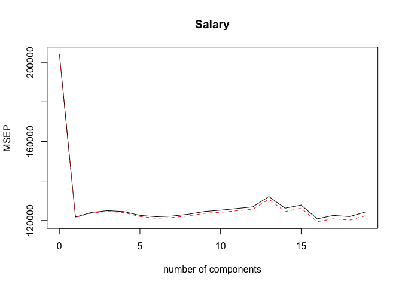
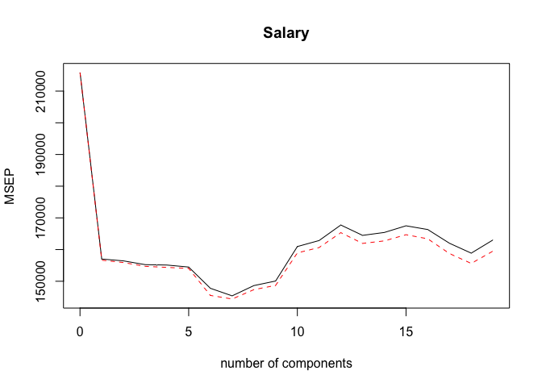
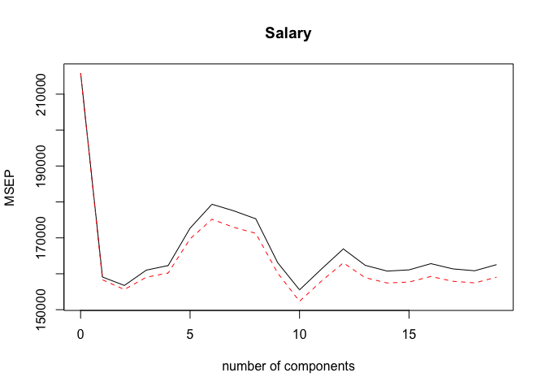

PCR and PLS Regression
================
Amin Yakubu
2/21/2019

``` r
library(ISLR)
library(tidyverse)
```

    ## ── Attaching packages ──────────────────────────────────────────────────────────────────────────────────────── tidyverse 1.2.1 ──

    ## ✔ ggplot2 3.1.0     ✔ purrr   0.2.5
    ## ✔ tibble  1.4.2     ✔ dplyr   0.7.8
    ## ✔ tidyr   0.8.1     ✔ stringr 1.3.1
    ## ✔ readr   1.1.1     ✔ forcats 0.3.0

    ## ── Conflicts ─────────────────────────────────────────────────────────────────────────────────────────── tidyverse_conflicts() ──
    ## ✖ dplyr::filter() masks stats::filter()
    ## ✖ dplyr::lag()    masks stats::lag()

``` r
library(pls)
```

    ## 
    ## Attaching package: 'pls'

    ## The following object is masked from 'package:stats':
    ## 
    ##     loadings

Principal Components Regression (PCR)
-------------------------------------

Principal components regression (PCR) can be performed using the pcr() function, which is part of the pls library. We now apply PCR to the Hitters pcr() data, in order to predict Salary

``` r
data("Hitters")
# Checking for missing values
sum(is.na(Hitters$Salary))
```

    ## [1] 59

``` r
# removing missing values
Hitters = na.omit(Hitters)
sum(is.na(Hitters))
```

    ## [1] 0

``` r
set.seed(2)

pcr.fit = pcr(Salary ~., data = Hitters, scale = TRUE, validation = "CV")
```

Setting scale=TRUE has the effect of standardizing each predictor, prior to generating the principal components, so that the scale on which each variable is measured will not have an effect.

Setting validation="CV" causes pcr() to compute the ten-fold cross-validation error for each possible value of M , the number of principal components used. The resulting fit can be examined using summary()

``` r
summary(pcr.fit)
```

    ## Data:    X dimension: 263 19 
    ##  Y dimension: 263 1
    ## Fit method: svdpc
    ## Number of components considered: 19
    ## 
    ## VALIDATION: RMSEP
    ## Cross-validated using 10 random segments.
    ##        (Intercept)  1 comps  2 comps  3 comps  4 comps  5 comps  6 comps
    ## CV             452    348.9    352.2    353.5    352.8    350.1    349.1
    ## adjCV          452    348.7    351.8    352.9    352.1    349.3    348.0
    ##        7 comps  8 comps  9 comps  10 comps  11 comps  12 comps  13 comps
    ## CV       349.6    350.9    352.9     353.8     355.0     356.2     363.5
    ## adjCV    348.5    349.8    351.6     352.3     353.4     354.5     361.6
    ##        14 comps  15 comps  16 comps  17 comps  18 comps  19 comps
    ## CV        355.2     357.4     347.6     350.1     349.2     352.6
    ## adjCV     352.8     355.2     345.5     347.6     346.7     349.8
    ## 
    ## TRAINING: % variance explained
    ##         1 comps  2 comps  3 comps  4 comps  5 comps  6 comps  7 comps
    ## X         38.31    60.16    70.84    79.03    84.29    88.63    92.26
    ## Salary    40.63    41.58    42.17    43.22    44.90    46.48    46.69
    ##         8 comps  9 comps  10 comps  11 comps  12 comps  13 comps  14 comps
    ## X         94.96    96.28     97.26     97.98     98.65     99.15     99.47
    ## Salary    46.75    46.86     47.76     47.82     47.85     48.10     50.40
    ##         15 comps  16 comps  17 comps  18 comps  19 comps
    ## X          99.75     99.89     99.97     99.99    100.00
    ## Salary     50.55     53.01     53.85     54.61     54.61

The CV score is provided for each possible number of components, ranging from M = 0 onwards. Note that pcr() reports the root mean squared error; in order to obtain the usual MSE, we must square this quantity

One can also plot the cross-validation scores using the validationplot() function. Using val.type="MSEP" will cause the cross-validation MSE to be plot() plotted.

``` r
validationplot(pcr.fit, val.type = "MSEP")
```



We see that the smallest cross-validation error occurs when M = 16 components are used. This is barely fewer than M = 19, which amounts to simply performing least squares, because when all of the components are used in PCR no dimension reduction occurs. However, from the plot we also see that the cross-validation error is roughly the same when only one component is included in the model. This suggests that a model that uses just a small number of components might suffice.

The summary() function also provides the percentage of variance explained in the predictors and in the response using different numbers of components.

We now perform PCR on the training data and evaluate its test set performance.

``` r
x = model.matrix(Salary ~., Hitters)[,-1] 
y = Hitters$Salary

set.seed(1)
train = sample(1:nrow(Hitters), nrow(Hitters)/2)
test = (-train)
y.test = y[test]


pcr.fit = pcr(Salary~ ., data = Hitters, subset = train, scale = TRUE, validation = "CV")

validationplot(pcr.fit, val.type = "MSEP")
```



Now we find that the lowest cross-validation error occurs when M = 7 component are used. We compute the test MSE as follows.

``` r
pcr.pred = predict(pcr.fit, x[test,], ncomp = 7) 

mean((pcr.pred - y.test) ^ 2)
```

    ## [1] 96556.22

This test set MSE is competitive with the results obtained using ridge re- gression and the lasso. However, as a result of the way PCR is implemented, the final model is more difficult to interpret because it does not perform any kind of variable selection or even directly produce coefficient estimates.

Finally, we fit PCR on the full data set, using M = 7, the number of components identified by cross-validation.

``` r
pcr.fit = pcr(y ~ x, scale = TRUE, ncomp = 7) 
summary(pcr.fit)
```

    ## Data:    X dimension: 263 19 
    ##  Y dimension: 263 1
    ## Fit method: svdpc
    ## Number of components considered: 7
    ## TRAINING: % variance explained
    ##    1 comps  2 comps  3 comps  4 comps  5 comps  6 comps  7 comps
    ## X    38.31    60.16    70.84    79.03    84.29    88.63    92.26
    ## y    40.63    41.58    42.17    43.22    44.90    46.48    46.69

Partial Least Squares Regression
--------------------------------

We implement partial least squares (PLS) using the plsr() function, also in the pls library

``` r
pls.fit = plsr(Salary ~ ., data = Hitters, subset = train, scale = TRUE, validation = "CV") 
summary(pls.fit)
```

    ## Data:    X dimension: 131 19 
    ##  Y dimension: 131 1
    ## Fit method: kernelpls
    ## Number of components considered: 19
    ## 
    ## VALIDATION: RMSEP
    ## Cross-validated using 10 random segments.
    ##        (Intercept)  1 comps  2 comps  3 comps  4 comps  5 comps  6 comps
    ## CV           464.6    398.9    395.9    401.3    402.9    415.6    423.5
    ## adjCV        464.6    397.9    394.5    398.8    400.3    412.0    418.5
    ##        7 comps  8 comps  9 comps  10 comps  11 comps  12 comps  13 comps
    ## CV       421.3    418.7    403.9     394.4     401.6     408.6     402.9
    ## adjCV    415.9    413.8    400.3     390.3     397.5     403.8     398.6
    ##        14 comps  15 comps  16 comps  17 comps  18 comps  19 comps
    ## CV        400.9     401.4     403.5     401.7     401.0     403.2
    ## adjCV     396.8     397.1     399.1     397.4     396.8     398.8
    ## 
    ## TRAINING: % variance explained
    ##         1 comps  2 comps  3 comps  4 comps  5 comps  6 comps  7 comps
    ## X         38.12    53.46    66.05    74.49    79.33    84.56    87.09
    ## Salary    33.58    38.96    41.57    42.43    44.04    45.59    47.05
    ##         8 comps  9 comps  10 comps  11 comps  12 comps  13 comps  14 comps
    ## X         90.74    92.55     93.94     97.23     97.88     98.35     98.85
    ## Salary    47.53    48.42     49.68     50.04     50.54     50.78     50.92
    ##         15 comps  16 comps  17 comps  18 comps  19 comps
    ## X          99.11     99.43     99.78     99.99    100.00
    ## Salary     51.04     51.11     51.15     51.16     51.18

``` r
validationplot(pls.fit, val.type = "MSEP")
```



The lowest cross-validation error occurs when only M = 2 partial least squares directions are used. We now evaluate the corresponding test set MSE

``` r
pls.pred = predict(pls.fit, x[test,], ncomp = 2) 

mean((pls.pred - y.test)^2)
```

    ## [1] 101417.5

The test MSE is comparable to, but slightly higher than, the test MSE obtained using ridge regression, the lasso, and PCR. Finally, we perform PLS using the full data set, using M = 2, the number of components identified by cross-validation

``` r
pls.fit = plsr(Salary ~ ., data = Hitters, scale = TRUE, ncomp = 2) 
summary(pls.fit)
```

    ## Data:    X dimension: 263 19 
    ##  Y dimension: 263 1
    ## Fit method: kernelpls
    ## Number of components considered: 2
    ## TRAINING: % variance explained
    ##         1 comps  2 comps
    ## X         38.08    51.03
    ## Salary    43.05    46.40

Notice that the percentage of variance in Salary that the two-component PLS fit explains, 46.40 %, is almost as much as that explained using the final seven-component model PCR fit, 46.69 %. This is because PCR only attempts to maximize the amount of variance explained in the predictors, while PLS searches for directions that explain variance in both the predictors and the response.
