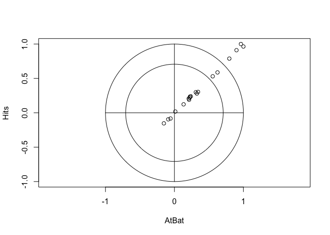

Ridge Regression, Lasso & Dimention reduction methods
================
Amin Yakubu
2/13/2019

``` r
library(ISLR)
library(glmnet) # For lasso, ridge & elastic net
library(caret) # for train function
library(corrplot) # For correlation plot
library(plotmo) # for trace plot. glmnet can also produce plots but this one is better
library(pls)
```

Predict a baseball player’s salary on the basis of various statistics associated with performance in the previous year. Use `?Hitters` for more details.

``` r
data(Hitters)
# delete rows containing the missing data
Hitters <- na.omit(Hitters)

# matrix of predictors (glmnet uses input matrix). We specify the response and use . the specify all predictors
x <- model.matrix(Salary ~ . , Hitters)[,-1] # we delete the intercept (which is the first column)

# vector of response
y <- Hitters$Salary

corrplot(cor(x), method = 'square') # method is optional
```

    ## Warning in plot.window(...): "method" is not a graphical parameter

    ## Warning in plot.xy(xy, type, ...): "method" is not a graphical parameter

    ## Warning in axis(side = side, at = at, labels = labels, ...): "method" is
    ## not a graphical parameter

    ## Warning in axis(side = side, at = at, labels = labels, ...): "method" is
    ## not a graphical parameter

    ## Warning in box(...): "method" is not a graphical parameter

    ## Warning in title(...): "method" is not a graphical parameter



Ridge regression using `glmnet()`
---------------------------------

`alpha` is the elasticnet mixing parameter. The penalty on the coefficient vetor for predictor *j* is (1 − *α*)/2||*β*<sub>*j*</sub>||<sub>2</sub><sup>2</sup> + *α*||*β*<sub>*j*</sub>||<sub>1</sub>. `alpha=1` is the lasso penalty, and `alpha=0` the ridge penalty. `glmnet()` function standardizes the variables by default. `ridge.mod` contains the coefficient estimates for a set of lambda values. The grid for lambda is in `ridge.mod$lambda`.

``` r
# fit the ridge regression (alpha = 0) with a sequence of lambdas
ridge.mod <- glmnet(x, y, alpha = 0, lambda = exp(seq(-1, 10, length = 100))) # 100 you will have 100 solutions. 
# default here is standardized. 
# set alpha = 0 for ridge
# set alpha = 1 for lasso
# lambda is trying different values. Alternatively use nlambda = 100. It will choose the values automatically
# another function standardize = TRUE meaning you will center you predictors and outcome

ridge.mod$lambda
```

    ##   [1] 2.202647e+04 1.971015e+04 1.763742e+04 1.578265e+04 1.412294e+04
    ##   [6] 1.263776e+04 1.130876e+04 1.011953e+04 9.055351e+03 8.103084e+03
    ##  [11] 7.250958e+03 6.488442e+03 5.806113e+03 5.195539e+03 4.649172e+03
    ##  [16] 4.160262e+03 3.722766e+03 3.331277e+03 2.980958e+03 2.667478e+03
    ##  [21] 2.386965e+03 2.135950e+03 1.911332e+03 1.710335e+03 1.530475e+03
    ##  [26] 1.369529e+03 1.225508e+03 1.096633e+03 9.813105e+02 8.781152e+02
    ##  [31] 7.857720e+02 7.031397e+02 6.291970e+02 5.630302e+02 5.038216e+02
    ##  [36] 4.508394e+02 4.034288e+02 3.610039e+02 3.230405e+02 2.890694e+02
    ##  [41] 2.586706e+02 2.314687e+02 2.071272e+02 1.853456e+02 1.658545e+02
    ##  [46] 1.484132e+02 1.328059e+02 1.188400e+02 1.063427e+02 9.515961e+01
    ##  [51] 8.515256e+01 7.619786e+01 6.818484e+01 6.101447e+01 5.459815e+01
    ##  [56] 4.885657e+01 4.371878e+01 3.912128e+01 3.500726e+01 3.132588e+01
    ##  [61] 2.803162e+01 2.508380e+01 2.244597e+01 2.008554e+01 1.797333e+01
    ##  [66] 1.608324e+01 1.439192e+01 1.287845e+01 1.152415e+01 1.031226e+01
    ##  [71] 9.227814e+00 8.257411e+00 7.389056e+00 6.612018e+00 5.916694e+00
    ##  [76] 5.294490e+00 4.737718e+00 4.239496e+00 3.793668e+00 3.394723e+00
    ##  [81] 3.037732e+00 2.718282e+00 2.432425e+00 2.176630e+00 1.947734e+00
    ##  [86] 1.742909e+00 1.559623e+00 1.395612e+00 1.248849e+00 1.117519e+00
    ##  [91] 1.000000e+00 8.948393e-01 8.007374e-01 7.165313e-01 6.411804e-01
    ##  [96] 5.737534e-01 5.134171e-01 4.594258e-01 4.111123e-01 3.678794e-01

`coef(ridge.mod)` gives the coefficient matrix. Each column is the fit corresponding to one lambda value.

``` r
mat.coef <- coef(ridge.mod)
dim(mat.coef)
```

    ## [1]  20 100

### Cross-validation

We use cross-validation to determine the optimal value of lambda. The two vertical lines are the for minimal MSE and 1SE rule. The 1SE rule gives the model with fewest coefficients that's less than one SE away from the sub-model with the lowest error.

``` r
set.seed(2)
cv.ridge <- cv.glmnet(x, y, 
                      alpha = 0, 
                      lambda = exp(seq(-1, 10, length = 100)), 
                      type.measure = "mse")

# here alpha = 0, meaning ridge
# type.measure the metric to decide the best model. 

plot(cv.ridge)
```


``` r
# the redline is the mse for each lambda value
# we also see the mse + SE and mse - SE
# the first dashed line shows the optimal value for lambda
# second dashed line is the 1 standared error rule - gives the model with the fewest coefficients. Another good model esp if you want few parameters. It depends on your own choice. They are both good.
```

### Trace plot

There are two functions for generating the trace plot.

``` r
plot(ridge.mod, xvar = "lambda", label = TRUE)
```


``` r
plot_glmnet(ridge.mod, xvar = "rlambda", label = 19) # label = 10 is the defaul
```


### Coefficients of the final model

Get the coefficients of the optimal model. `s` is value of the penalty parameter `lambda` at which predictions are required.

``` r
best.lambda <- cv.ridge$lambda.min # cv.ridge$labmda.1se gives you the other optimal value on the other side of the plot
best.lambda
```

    ## [1] 4.239496

``` r
predict(ridge.mod, s = best.lambda, type = "coefficients") # the coefficents are on the original scale -- not scaled
```

    ## 20 x 1 sparse Matrix of class "dgCMatrix"
    ##                         1
    ## (Intercept)  149.22633062
    ## AtBat         -1.60997670
    ## Hits           5.61921653
    ## HmRun          0.63498887
    ## Runs          -0.32293926
    ## RBI            0.06725632
    ## Walks          5.22312846
    ## Years        -10.42026714
    ## CAtBat        -0.05557923
    ## CHits          0.20316697
    ## CHmRun         0.72476255
    ## CRuns          0.69350591
    ## CRBI           0.36360275
    ## CWalks        -0.60569491
    ## LeagueN       61.37840710
    ## DivisionW   -122.78299563
    ## PutOuts        0.27944521
    ## Assists        0.28974207
    ## Errors        -3.76586590
    ## NewLeagueN   -27.92044299

``` r
# use type = 'response' for homework. and also use newx = to a matrix. So it will return a vector of predicted responses
```

Lasso using `glmnet()`
----------------------

The syntax is along the same line as ridge regression. Now we use `alpha = 1`.

``` r
cv.lasso <- cv.glmnet(x,y, alpha = 1, lambda = exp(seq(-1, 5, length = 100)))
cv.lasso$lambda.min
```

    ## [1] 2.888121

``` r
# alpha = 1 is lasso and alpha = 0 is ridge
```

``` r
plot(cv.lasso)
```


``` r
# shows the number of non zero coefficents. Look at the numbers on top of the model
```

``` r
# cv.lasso$glmnet.fit is a fitted glmnet object for the full data
# You can also plot the result obtained from glmnet()
plot(cv.lasso$glmnet.fit, xvar = "lambda", label = TRUE)
```


``` r
plot_glmnet(cv.lasso$glmnet.fit)
```


``` r
predict(cv.lasso, s = "lambda.min", type = "coefficients")
```

    ## 20 x 1 sparse Matrix of class "dgCMatrix"
    ##                        1
    ## (Intercept)  116.5367637
    ## AtBat         -1.4948043
    ## Hits           5.5615474
    ## HmRun          .        
    ## Runs           .        
    ## RBI            .        
    ## Walks          4.6148464
    ## Years         -8.8197352
    ## CAtBat         .        
    ## CHits          .        
    ## CHmRun         0.5367614
    ## CRuns          0.6455687
    ## CRBI           0.3723109
    ## CWalks        -0.5058885
    ## LeagueN       32.2153588
    ## DivisionW   -119.0062145
    ## PutOuts        0.2714146
    ## Assists        0.1626281
    ## Errors        -1.9397895
    ## NewLeagueN     .

``` r
# you can also use the actual number for s
```

Ridge and lasso using `caret`
-----------------------------

``` r
ctrl1 <- trainControl(method = "repeatedcv", number = 10, repeats = 5)
# you can try other options

set.seed(2)
ridge.fit <- train(x, y,
                     method = "glmnet",
                     tuneGrid = expand.grid(alpha = 0, 
                                            lambda = exp(seq(-1, 10, length = 100))),
                   # preProc = c("center", "scale"),
                     trControl = ctrl1)
# preProc was not used because that's the default for glmnet. Other methods it may not be the default

plot(ridge.fit)
```


``` r
plot(ridge.fit, xTrans = function(x) log(x)) # here were are plotting log lambda so it looks like the previous plots
```


``` r
names(ridge.fit)
```

    ##  [1] "method"       "modelInfo"    "modelType"    "results"     
    ##  [5] "pred"         "bestTune"     "call"         "dots"        
    ##  [9] "metric"       "control"      "finalModel"   "preProcess"  
    ## [13] "trainingData" "resample"     "resampledCM"  "perfNames"   
    ## [17] "maximize"     "yLimits"      "times"        "levels"

``` r
ridge.fit$bestTune
```

    ##    alpha   lambda
    ## 38     0 22.44597

``` r
coef(ridge.fit$finalModel, ridge.fit$bestTune$lambda)
```

    ## 20 x 1 sparse Matrix of class "dgCMatrix"
    ##                         1
    ## (Intercept)  8.112693e+01
    ## AtBat       -6.815959e-01
    ## Hits         2.772312e+00
    ## HmRun       -1.365680e+00
    ## Runs         1.014826e+00
    ## RBI          7.130225e-01
    ## Walks        3.378558e+00
    ## Years       -9.066800e+00
    ## CAtBat      -1.199478e-03
    ## CHits        1.361029e-01
    ## CHmRun       6.979958e-01
    ## CRuns        2.958896e-01
    ## CRBI         2.570711e-01
    ## CWalks      -2.789666e-01
    ## LeagueN      5.321272e+01
    ## DivisionW   -1.228345e+02
    ## PutOuts      2.638876e-01
    ## Assists      1.698796e-01
    ## Errors      -3.685645e+00
    ## NewLeagueN  -1.810510e+01

``` r
# you can use predict on the ridge.fit$finalModel. Because ridge.fit$finalModel is a glmnet object
```

``` r
set.seed(2)
lasso.fit <- train(x, y,
                     method = "glmnet",
                     tuneGrid = expand.grid(alpha = 1, 
                                            lambda = exp(seq(-1, 5, length = 100))),
                   # preProc = c("center", "scale"),
                     trControl = ctrl1)

plot(lasso.fit, xTrans = function(x) log(x))
```


``` r
lasso.fit$bestTune
```

    ##    alpha   lambda
    ## 34     1 2.718282

``` r
coef(lasso.fit$finalModel,lasso.fit$bestTune$lambda)
```

    ## 20 x 1 sparse Matrix of class "dgCMatrix"
    ##                        1
    ## (Intercept)  122.7036652
    ## AtBat         -1.5350416
    ## Hits           5.6337077
    ## HmRun          .        
    ## Runs           .        
    ## RBI            .        
    ## Walks          4.7077121
    ## Years         -9.5278084
    ## CAtBat         .        
    ## CHits          .        
    ## CHmRun         0.5057445
    ## CRuns          0.6554434
    ## CRBI           0.3932329
    ## CWalks        -0.5241348
    ## LeagueN       31.9907784
    ## DivisionW   -119.2910396
    ## PutOuts        0.2720718
    ## Assists        0.1708952
    ## Errors        -2.0389969
    ## NewLeagueN     .

``` r
set.seed(2)
enet.fit <- train(x, y,
                     method = "glmnet",
                     tuneGrid = expand.grid(alpha = seq(0, 1, length = 5), 
                                            # We are seeing if alpha between 0 and 1 is better
                                            lambda = exp(seq(-2, 4, length = 50))),
                   # preProc = c("center", "scale"),
                     trControl = ctrl1)

# for each alpha we have 50 lambdas. 
enet.fit$bestTune
```

    ##     alpha   lambda
    ## 225     1 2.556849

``` r
ggplot(enet.fit)
```


``` r
set.seed(2)
lm.fit <- train(x, y,
                method = "lm",
                trControl = ctrl1)

resamp <- resamples(list(lasso = lasso.fit, ridge = ridge.fit, lm = lm.fit, enet = enet.fit)) # here we can compare the models
summary(resamp)
```

    ## 
    ## Call:
    ## summary.resamples(object = resamp)
    ## 
    ## Models: lasso, ridge, lm, enet 
    ## Number of resamples: 50 
    ## 
    ## MAE 
    ##           Min.  1st Qu.   Median     Mean  3rd Qu.     Max. NA's
    ## lasso 167.8420 205.6732 236.3658 233.6655 254.1476 331.5538    0
    ## ridge 160.1742 209.1149 229.7622 233.5423 258.4432 328.8789    0
    ## lm    179.7526 219.1404 237.5740 239.4876 261.3989 331.6590    0
    ## enet  168.6762 206.3211 236.2156 233.8372 254.5370 330.9309    0
    ## 
    ## RMSE 
    ##           Min.  1st Qu.   Median     Mean  3rd Qu.     Max. NA's
    ## lasso 208.7781 282.9478 311.3332 329.8454 348.8886 542.4902    0
    ## ridge 199.6564 281.2640 311.9637 330.7488 353.7262 542.2358    0
    ## lm    231.5831 286.7221 318.2538 337.1979 354.3965 594.9582    0
    ## enet  209.3123 282.2664 311.7742 329.8630 348.1674 543.5909    0
    ## 
    ## Rsquared 
    ##              Min.   1st Qu.    Median      Mean   3rd Qu.      Max. NA's
    ## lasso 0.005094987 0.3447779 0.5133295 0.4774190 0.6315335 0.7653965    0
    ## ridge 0.001370537 0.3430458 0.5154361 0.4753980 0.6292286 0.7998328    0
    ## lm    0.019695547 0.3275225 0.4922025 0.4591266 0.5924145 0.8122387    0
    ## enet  0.005565354 0.3442027 0.5134468 0.4773154 0.6287449 0.7635855    0

``` r
parallelplot(resamp, metric = "RMSE") # There are 50 curves showing the performances of the 4 models
```


``` r
bwplot(resamp, metric = "RMSE") # here we used a box plot
```


Dimension Reduction Methods
===========================

Predict a baseball player’s salary on the basis of various statistics associated with performance in the previous year. Use `?Hitters` for more details.

Ideally, a model should be evaluated on datasets that were not used to build or fine-tune the model, so that they provide an unbiased sense of model effectiveness. When a large amount of data is at hand, a set of samples can be set aside to evaluate the final model. However, when the number of samples is not large, a test set may be avoided because every sample may be needed for model building. Moreover, the size of the test set may not have sufficient power or precision to make reasonable judgements.

Last time we used all the data to build the models. This time we split the data into a training set and a test set.

``` r
data(Hitters)
# delete rows containing the missing data
Hitters <- na.omit(Hitters)

set.seed(2019)
trRows <- createDataPartition(Hitters$Salary,
                              p = .75,
                              list = F)

# training data
# matrix of predictors (glmnet uses input matrix)
x <- model.matrix(Salary~.,Hitters)[trRows,-1]
# vector of response
y <- Hitters$Salary[trRows]

# test data
x2 <- model.matrix(Salary~.,Hitters)[-trRows,-1]
y2 <- Hitters$Salary[-trRows]
```

Principal components regression (PCR)
-------------------------------------

We fit the PCR model using the function `pcr()`.

``` r
set.seed(2)
pcr.mod <- pcr(Salary~., 
               data = Hitters[trRows,],
               scale = TRUE, 
               validation = "CV")

summary(pcr.mod)
```

    ## Data:    X dimension: 200 19 
    ##  Y dimension: 200 1
    ## Fit method: svdpc
    ## Number of components considered: 19
    ## 
    ## VALIDATION: RMSEP
    ## Cross-validated using 10 random segments.
    ##        (Intercept)  1 comps  2 comps  3 comps  4 comps  5 comps  6 comps
    ## CV           474.5    382.1    386.2    384.5    381.9    374.5    375.7
    ## adjCV        474.5    381.5    385.4    383.7    381.0    373.3    374.4
    ##        7 comps  8 comps  9 comps  10 comps  11 comps  12 comps  13 comps
    ## CV       376.6    378.1    379.8     386.9     388.1     390.7     384.6
    ## adjCV    375.2    376.6    378.2     384.8     385.9     388.5     382.4
    ##        14 comps  15 comps  16 comps  17 comps  18 comps  19 comps
    ## CV        367.2     368.0     364.6     361.9     360.7     363.5
    ## adjCV     363.5     365.5     362.1     359.2     358.0     360.5
    ## 
    ## TRAINING: % variance explained
    ##         1 comps  2 comps  3 comps  4 comps  5 comps  6 comps  7 comps
    ## X         39.05    59.97    70.49    79.23    84.48    88.71    92.51
    ## Salary    38.23    38.64    39.34    40.52    43.58    44.38    44.76
    ##         8 comps  9 comps  10 comps  11 comps  12 comps  13 comps  14 comps
    ## X         95.11    96.36     97.35     98.16     98.76     99.15     99.47
    ## Salary    45.55    45.57     46.20     46.31     46.35     48.35     53.51
    ##         15 comps  16 comps  17 comps  18 comps  19 comps
    ## X          99.75     99.90     99.97     99.99    100.00
    ## Salary     53.57     55.06     56.27     56.88     57.24

``` r
validationplot(pcr.mod, val.type = "MSEP", legendpos = "topright")
```


``` r
predy2.pcr <- predict(pcr.mod, newdata = Hitters[-trRows,], 
                      ncomp = 18)
# test MSE
mean((predy2.pcr - y2)^2)
```

    ## [1] 126063.2

Partial least squares (PLS)
---------------------------

We fit the PLS model using the function `plsr()`.

``` r
set.seed(2)
pls.mod <- plsr(Salary~., 
                data = Hitters[trRows,], 
                scale = TRUE,  
                validation = "CV")

summary(pls.mod)
```

    ## Data:    X dimension: 200 19 
    ##  Y dimension: 200 1
    ## Fit method: kernelpls
    ## Number of components considered: 19
    ## 
    ## VALIDATION: RMSEP
    ## Cross-validated using 10 random segments.
    ##        (Intercept)  1 comps  2 comps  3 comps  4 comps  5 comps  6 comps
    ## CV           474.5    379.4    379.7    377.6    376.0    383.2    377.5
    ## adjCV        474.5    378.8    378.0    376.2    374.2    379.7    373.9
    ##        7 comps  8 comps  9 comps  10 comps  11 comps  12 comps  13 comps
    ## CV       371.2    367.1    360.7     361.2     361.4     361.7     362.2
    ## adjCV    367.9    364.2    358.3     358.9     358.7     359.0     359.5
    ##        14 comps  15 comps  16 comps  17 comps  18 comps  19 comps
    ## CV        360.6     360.6     362.9     363.2     362.4     363.5
    ## adjCV     358.0     357.9     360.1     360.2     359.6     360.5
    ## 
    ## TRAINING: % variance explained
    ##         1 comps  2 comps  3 comps  4 comps  5 comps  6 comps  7 comps
    ## X         38.84    48.72     64.6    73.33    77.44    83.96    87.83
    ## Salary    40.66    45.64     47.1    48.75    52.05    53.69    54.85
    ##         8 comps  9 comps  10 comps  11 comps  12 comps  13 comps  14 comps
    ## X         90.78    92.57     95.68     96.68     97.53     98.22     98.77
    ## Salary    55.34    55.75     55.95     56.49     56.63     56.75     56.86
    ##         15 comps  16 comps  17 comps  18 comps  19 comps
    ## X          99.13     99.62     99.71     99.97    100.00
    ## Salary     56.96     57.00     57.11     57.13     57.24

``` r
validationplot(pls.mod, val.type="MSEP", legendpos = "topright")
```


``` r
predy2.pls <- predict(pcr.mod, newdata = Hitters[-trRows,], 
                      ncomp = 15)
# test MSE
mean((predy2.pls-y2)^2)
```

    ## [1] 131660.1

PCR and PLS using `caret`
-------------------------

### PCR

``` r
ctrl1 <- trainControl(method = "repeatedcv", number = 10, repeats = 5)

# Two ways for standardizing predictors
# train(..., preProc = c("center", "scale"))
set.seed(2)
pcr.fit <- train(x, y,
                 method = "pcr",
                 tuneLength = 18, # number of components or specifiy tunegrid 1 to 18. 
                 trControl = ctrl1,
                 preProc = c("center", "scale"))

# need to preprocess your data when using predict()
trans <- preProcess(x, method = c("center", "scale"))

predy2.pcr2 <- predict(pcr.fit$finalModel, newdata = predict(trans, x2), 
                       ncomp = pcr.fit$bestTune$ncomp)

mean((predy2.pcr2 - y2)^2)
```

    ## [1] 127185.6

``` r
# pcr(..., scale = TRUE)
set.seed(2)
pcr.fit2 <- train(x, y,
                  method = "pcr",
                  tuneLength = 18,
                  trControl = ctrl1,
                  scale = TRUE) # When scale = True. There's no need for preprocessing

predy2.pcr3 <- predict(pcr.fit2$finalModel, newdata = x2, 
                       ncomp = pcr.fit2$bestTune$ncomp)
mean((predy2.pcr3-y2)^2)
```

    ## [1] 127185.6

``` r
ggplot(pcr.fit, highlight = TRUE) + theme_bw()
```


``` r
# ggplot(pcr.fit2, highlight = TRUE) # the same plot
```

### PLS

``` r
set.seed(2)
pls.fit <- train(x, y,
                 method = "pls",
                 tuneLength = 18,
                 trControl = ctrl1,
                 scale = TRUE)
predy2.pls2 <- predict(pls.fit$finalModel, newdata = x2, 
                       ncomp = pls.fit$bestTune$ncomp)
mean((predy2.pls2-y2)^2)
```

    ## [1] 134127.5

``` r
ggplot(pls.fit, highlight = TRUE)
```


Here are some old codes on ridge, lasso and ordinary least squares.

``` r
set.seed(2)
ridge.fit <- train(x, y,
                   method = "glmnet",
                   tuneGrid = expand.grid(alpha = 0, 
                                          lambda = exp(seq(-1, 10, length=100))),
                   # preProc = c("center", "scale"),
                   trControl = ctrl1)
predy2.ridge <- predict(ridge.fit$finalModel, newx = x2, 
                        s = ridge.fit$bestTune$lambda, type = "response")
mean((predy2.ridge-y2)^2)
```

    ## [1] 92017.59

``` r
set.seed(2)
lasso.fit <- train(x, y,
                   method = "glmnet",
                   tuneGrid = expand.grid(alpha = 1, 
                                          lambda = exp(seq(-1, 5, length=100))),
                   # preProc = c("center", "scale"),
                   trControl = ctrl1)
predy2.lasso <- predict(lasso.fit$finalModel, newx = x2, 
                        s = lasso.fit$bestTune$lambda, type = "response")
mean((predy2.lasso-y2)^2)
```

    ## [1] 112504.4

``` r
set.seed(2)
lm.fit <- train(x, y,
                method = "lm",
                trControl = ctrl1)
predy2.lm <- predict(lm.fit$finalModel, newdata = data.frame(x2))
mean((predy2.lm-y2)^2)
```

    ## [1] 141081.7

Comparing the models based on resampling results.

``` r
resamp <- resamples(list(lasso = lasso.fit, 
                         ridge = ridge.fit, 
                         pcr = pcr.fit, 
                         pls = pls.fit,
                         lm = lm.fit))
summary(resamp)
```

    ## 
    ## Call:
    ## summary.resamples(object = resamp)
    ## 
    ## Models: lasso, ridge, pcr, pls, lm 
    ## Number of resamples: 50 
    ## 
    ## MAE 
    ##           Min.  1st Qu.   Median     Mean  3rd Qu.     Max. NA's
    ## lasso 129.5961 196.8895 240.0911 240.5615 286.2368 381.1578    0
    ## ridge 119.6522 198.1061 241.0162 240.7661 284.2971 389.3985    0
    ## pcr   139.0870 204.6036 243.0228 246.6090 288.0560 372.7077    0
    ## pls   131.9717 204.7615 245.9476 247.4816 288.8180 368.6580    0
    ## lm    132.8410 210.3150 248.1373 248.3146 288.5713 365.1336    0
    ## 
    ## RMSE 
    ##           Min.  1st Qu.   Median     Mean  3rd Qu.     Max. NA's
    ## lasso 168.0704 270.6731 318.6754 337.4900 380.7906 628.1882    0
    ## ridge 165.0014 280.8506 330.9004 341.7859 386.2073 642.5168    0
    ## pcr   180.1356 290.4375 324.2251 341.6701 390.9105 616.6150    0
    ## pls   175.5925 286.1919 321.0134 339.6781 399.3010 599.4569    0
    ## lm    172.5196 293.0081 333.1927 343.9548 387.8914 608.9039    0
    ## 
    ## Rsquared 
    ##             Min.   1st Qu.    Median      Mean   3rd Qu.      Max. NA's
    ## lasso 0.01475427 0.3776118 0.5068377 0.5045988 0.6673779 0.8380436    0
    ## ridge 0.01016833 0.3715938 0.4995226 0.4975515 0.6820965 0.8339000    0
    ## pcr   0.01973662 0.3530999 0.5200217 0.4928488 0.6616805 0.8313303    0
    ## pls   0.02202661 0.3492851 0.5241488 0.4955538 0.6645954 0.8365804    0
    ## lm    0.02480256 0.3459709 0.4881513 0.4865378 0.6595571 0.8487286    0

``` r
bwplot(resamp, metric = "RMSE")
```


