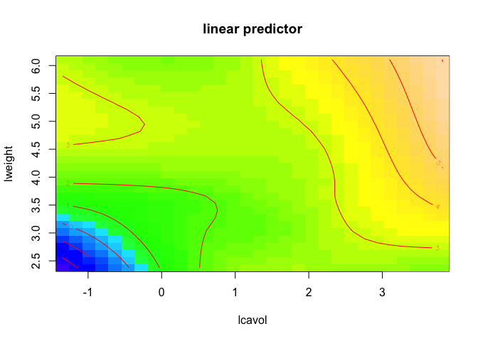

Nonlinear Methods: Splines and GAM
================

``` r
library(caret) # only for plot
library(splines)
library(lasso2) # only for data
library(mgcv)
library(tidyverse)
library(ggplot2)
```

We will use a prostate cancer dataset for illustration. The data come from a study that examined the correlation between the level of prostate specific antigen (PSA) and a number of clinical measures in men who were about to receive a radical prostatectomy. The dataset can be found in the package `lasso2`. The response is the log PSA level (`lpsa`).

``` r
data(Prostate)
# matrix of predictors 
x <- model.matrix(lpsa~.,Prostate)[,-1]
# vector of response
y <- Prostate$lpsa
```

We use scatterplot to explore the relationship between the log PSA level and other variables. The variable percentage Gleason score 4/5 (`pgg45`) shows some potentially nonlinear trend.

``` r
theme1 <- trellis.par.get()
theme1$plot.symbol$col <- rgb(.2, .4, .2, .5)
theme1$plot.symbol$pch <- 16
theme1$plot.line$col <- rgb(.8, .1, .1, 1)
theme1$plot.line$lwd <- 2
theme1$strip.background$col <- rgb(.0, .2, .6, .2)
trellis.par.set(theme1)
featurePlot(x, y, plot = "scatter", labels = c("","Y"),
            type = c("p"), layout = c(4, 2))
```


In what follows, we fit univariate nonlinear models and GAM to investage the association between `lpsa` and `pgg45`.

Polynomial regression
---------------------

The function `poly()` returns a matrix whose columns are a basis of orthogonal polynomials, which essentially means that each column is a linear combination of `pgg45`, `pgg45^2`, `pgg45^3`, and `pgg45^4`.

``` r
fit1 <- lm(lpsa~pgg45, data = Prostate)
fit2 <- lm(lpsa~poly(pgg45,2), data = Prostate) 
fit3 <- lm(lpsa~poly(pgg45,3), data = Prostate)
fit4 <- lm(lpsa~poly(pgg45,4), data = Prostate) 
fit5 <- lm(lpsa~poly(pgg45,5), data = Prostate)
```

Use `anova()` to test the null hypothesis that a simpler model is sufficient to explain the data against the alternative hypothesis that a more complex model is required. In order to use ANOVA, the models must be nested.

``` r
anova(fit1,fit2,fit3,fit4,fit5)
```

    ## Analysis of Variance Table
    ## 
    ## Model 1: lpsa ~ pgg45
    ## Model 2: lpsa ~ poly(pgg45, 2)
    ## Model 3: lpsa ~ poly(pgg45, 3)
    ## Model 4: lpsa ~ poly(pgg45, 4)
    ## Model 5: lpsa ~ poly(pgg45, 5)
    ##   Res.Df     RSS Df Sum of Sq      F   Pr(>F)   
    ## 1     95 105.103                                
    ## 2     94  96.807  1    8.2961 8.0535 0.005599 **
    ## 3     93  96.179  1    0.6280 0.6096 0.436967   
    ## 4     92  94.711  1    1.4684 1.4255 0.235609   
    ## 5     91  93.741  1    0.9701 0.9418 0.334394   
    ## ---
    ## Signif. codes:  0 '***' 0.001 '**' 0.01 '*' 0.05 '.' 0.1 ' ' 1

Step function
-------------

The function `cut()` can be used to create step function basis. The argument `breaks` can be used to specify the cutpoints.

``` r
fit.sf <- lm(lpsa~cut(pgg45, 4), data = Prostate)
```

Splines
-------

We first look at the shape of cubic spline basis using B-spline representation. Note that the fitted line will be linear combination of these bases. They provides an equivalent fit but are not the same as the expression of cubic spline bases in the slides.

### B-spline basis for cubic splines

The function `bs()` can be used to generate the spline basis matrix. You can specify the degree of freedom via `df`; you may also use the `knots` and `degree` arguments.

``` r
df.bs <- 7
z <- seq(from = 0, to = 100, by = 1)
bsz <- data.frame(bs(z, df = df.bs, intercept = TRUE))
names(bsz) <- paste("basis", 1:df.bs)
bsz$z <- z

bsz2 <- bsz %>% 
  gather(paste("basis", 1:df.bs), key = basis.name, value='y')

ggplot(data = bsz2, aes(x=z, y=y)) +
  geom_line(aes(color=basis.name))
```


### B-spline basis for natural cubic splines

The function `ns()` can be used to generate the spline basis matrix for natural cubic splines.

``` r
df.ns <- 7
z <- seq(from = 0, to = 100, by = 1)
nsz <- data.frame(ns(z, df = df.ns, intercept = TRUE))
names(nsz) <- paste("basis", 1:df.ns)
nsz$z <- z

nsz2 <- nsz %>% 
  gather(paste("basis", 1:df.ns), key = basis.name, value='y')

ggplot(data = nsz2, aes(x=z, y=y)) +
  geom_line(aes(color=basis.name))
```


Cubic splines
-------------

We fit a cubic spline model. Degree of freedom `df` (or knots `knots`) need to be specified. The argument `degree` denotes the degree of the piecewise polynomial; default is 3 for cubic splines.

``` r
fit.bs <- lm(lpsa~bs(pgg45, df = 4), data = Prostate)
# fit.bs <- lm(lpsa~bs(pgg45, df = 5, intercept = TRUE)-1, data = Prostate)

pgg45lims <- range(Prostate$pgg45)
pgg45.grid <- seq(from = pgg45lims[1],to = pgg45lims[2])

pred.bs <- predict(fit.bs,
                   newdata = list(pgg45=pgg45.grid),
                   se = TRUE)

pred.bs.df <- data.frame(pred = pred.bs$fit,
                         pgg45 = pgg45.grid,
                         upper = pred.bs$fit+2*pred.bs$se,
                         lower = pred.bs$fit-2*pred.bs$se)

p <- ggplot(data = Prostate, aes(x = pgg45, y = lpsa)) +
     geom_point(color = rgb(.2, .4, .2, .5))

p + geom_line(aes(x = pgg45, y = pred), data = pred.bs.df,
              color = rgb(.8, .1, .1, 1)) +
    geom_line(aes(x = pgg45, y = upper), data = pred.bs.df,
              linetype = 2, col = "grey50") + 
    geom_line(aes(x = pgg45, y = lower), data = pred.bs.df,
              linetype = 2, col = "grey50") + theme_bw()
```


Natural cubic splines
---------------------

We then fit a natural cubic spline model that extraplate linearly beyond the boundary knots.

``` r
fit.ns <- lm(lpsa~ns(pgg45, df = 2), data = Prostate)

pred.ns <- predict(fit.ns,
                   newdata = list(pgg45=pgg45.grid),
                   se=TRUE)

pred.ns.df <- data.frame(pred = pred.ns$fit,
                         pgg45 = pgg45.grid,
                         upper = pred.ns$fit+2*pred.ns$se,
                         lower = pred.ns$fit-2*pred.ns$se)


p + geom_line(aes(x = pgg45, y = pred), data = pred.ns.df,
              color = rgb(.8, .1, .1, 1)) +
    geom_line(aes(x = pgg45, y = upper), data = pred.ns.df,
              linetype = 2, col = "grey50") + 
    geom_line(aes(x = pgg45, y = lower), data = pred.ns.df,
              linetype = 2, col = "grey50") + theme_bw()
```


Smoothing splines
-----------------

The function `smooth.spline()` can be used to fit smoothing spline models. Generalized cross-validation is used to select the degree of freedom (trace of the smoother matrix).

``` r
fit.ss <- smooth.spline(Prostate$pgg45, Prostate$lpsa)
fit.ss$df
```

    ## [1] 3.24361

``` r
pred.ss <- predict(fit.ss,
                   x = pgg45.grid)

pred.ss.df <- data.frame(pred = pred.ss$y,
                         pgg45 = pgg45.grid)

p +
geom_line(aes(x = pgg45, y = pred), data = pred.ss.df,
          color = rgb(.8, .1, .1, 1)) + theme_bw()
```


Local regression
----------------

We perform a local linear regression using `loess()`.

``` r
fit.loess <- loess(lpsa~pgg45, data = Prostate)

pred.loess <- predict(fit.loess,
                      newdata = data.frame(pgg45 = pgg45.grid))

pred.loess.df <- data.frame(pred = pred.loess,
                            pgg45 = pgg45.grid)

p + geom_line(aes(x = pgg45, y = pred), data = pred.loess.df,
              color = rgb(.8, .1, .1, 1)) + theme_bw()
```


GAM
---

`gam()` fits a generalized additive model (GAM) to data, the term ‘GAM’ being taken to include any quadratically penalized GLM and a variety of other models estimated by a quadratically penalised likelihood type approach. In `gam()`, built-in nonparametric smoothing terms are indicated by `s` for smoothing splines. The package `gam` also provides a function `gam()`. GCV is used to select the degree of freedom. Confidence/credible intervals are readily available for any quantity predicted using a fitted model.

``` r
gam.m1 <- gam(lpsa~age+pgg45+lcavol+lweight+lbph+svi+lcp+gleason, data = Prostate)
gam.m2 <- gam(lpsa~age+s(pgg45)+lcavol+lweight+lbph+svi+lcp+gleason, 
              data = Prostate) # The s means a smooting spline. You can also use lo() for local  regression. This is  only available  in the GAM  function in the  GAM  package. te() means  2  dimensional smooth function. It is more flexible that simply doing s(lcavol)  + s(lweight)
gam.m3 <- gam(lpsa~age+s(pgg45)+te(lcavol,lweight)+lbph+svi+lcp+gleason, 
              data = Prostate)

anova(gam.m1, gam.m2, gam.m3, test = "F")
```

    ## Analysis of Deviance Table
    ## 
    ## Model 1: lpsa ~ age + pgg45 + lcavol + lweight + lbph + svi + lcp + gleason
    ## Model 2: lpsa ~ age + s(pgg45) + lcavol + lweight + lbph + svi + lcp + 
    ##     gleason
    ## Model 3: lpsa ~ age + s(pgg45) + te(lcavol, lweight) + lbph + svi + lcp + 
    ##     gleason
    ##   Resid. Df Resid. Dev      Df Deviance      F  Pr(>F)  
    ## 1    88.000     44.163                                  
    ## 2    84.485     41.132  3.5154   3.0312 2.0734 0.10120  
    ## 3    73.739     31.975 10.7461   9.1569 2.0489 0.03636 *
    ## ---
    ## Signif. codes:  0 '***' 0.001 '**' 0.01 '*' 0.05 '.' 0.1 ' ' 1

``` r
plot(gam.m2)
```


``` r
vis.gam(gam.m3, view = c("lcavol","lweight"), 
        plot.type = "contour", color = "topo")
```



With the current support from `caret`, you may lose a significant amount of flexibility in `mgcv`.

``` r
ctrl1 <- trainControl(method = "cv", number = 10)
# you can try other options

set.seed(2)
gam.fit <- train(x, y,
                 method = "gam",
                 tuneGrid = data.frame(method = "GCV.Cp", select = c(TRUE,FALSE)),
                 trControl = ctrl1)

gam.fit$bestTune
```

    ##   select method
    ## 2   TRUE GCV.Cp

``` r
gam.fit$finalModel
```

    ## 
    ## Family: gaussian 
    ## Link function: identity 
    ## 
    ## Formula:
    ## .outcome ~ svi + gleason + s(pgg45) + s(lcp) + s(age) + s(lbph) + 
    ##     s(lweight) + s(lcavol)
    ## 
    ## Estimated degrees of freedom:
    ## 3.651 0.000 1.470 0.716 1.520 4.582  total = 14.94 
    ## 
    ## GCV score: 0.5357211

Multivariate Adaptive Regression Splines (MARS)
-----------------------------------------------

We next create a piecewise linear model using multivariate adaptive regression splines (MARS).

``` r
library(pdp)
library(earth)
```

Since there are two tuning parameters associated with the MARS model: the degree of interactions and the number of retained terms, we need to perform a grid search to identify the optimal combination of these hyperparameters that minimize prediction error

``` r
mars_grid <- expand.grid(degree = 1:2, 
                         nprune = 2:10)

set.seed(2)
mars.fit <- train(x, y,
                 method = "earth",
                 tuneGrid = mars_grid,
                 trControl = ctrl1)

ggplot(mars.fit)
```


``` r
mars.fit$bestTune
```

    ##    nprune degree
    ## 11      3      2

``` r
coef(mars.fit$finalModel) 
```

    ##                             (Intercept) 
    ##                                2.469426 
    ##                       h(lcavol-2.40964) 
    ##                                2.118874 
    ## h(0.751416-lcavol) * h(3.83622-lweight) 
    ##                               -1.994906

To better understand the relationship between these features and `lpsa`, we can create partial dependence plots (PDPs) for each feature individually and also an interaction PDP. This is used to examine the marginal effects of predictors.

``` r
p1 <- partial(mars.fit, pred.var = c("lcavol"), grid.resolution = 10) %>% autoplot()

p2 <- partial(mars.fit, pred.var = c("lcavol", "lweight"), grid.resolution = 10) %>% plotPartial(levelplot = FALSE, zlab = "yhat", drape = TRUE, 
            screen = list(z = 20, x = -60))

grid.arrange(p1, p2, ncol = 2)
```


``` r
bwplot(resamples(list(mars = mars.fit,
               gam = gam.fit)), metric = "RMSE")
```


