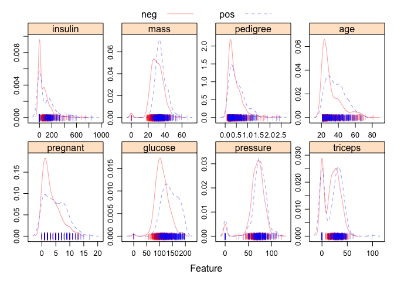
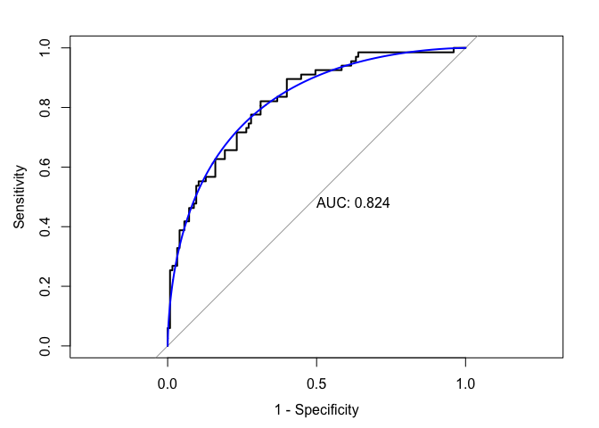
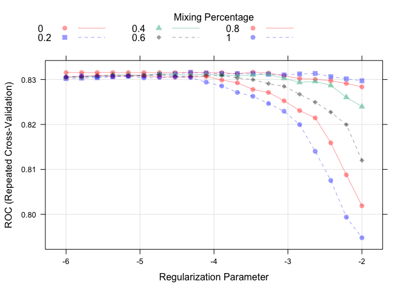
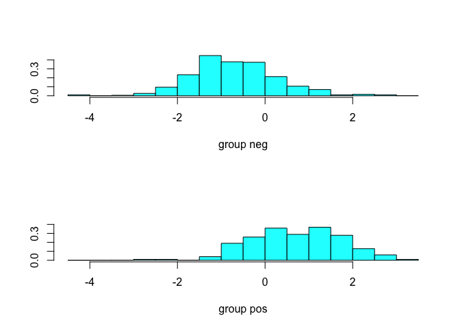
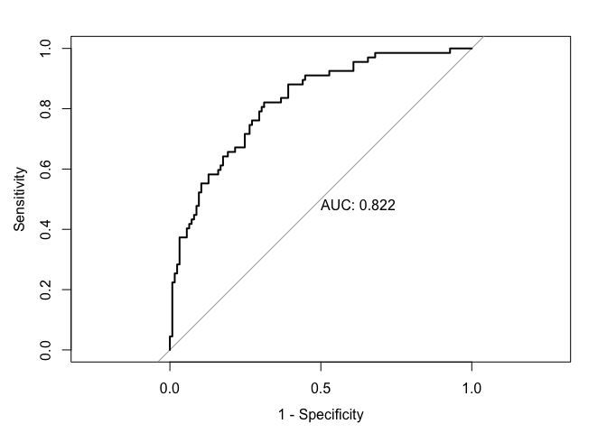
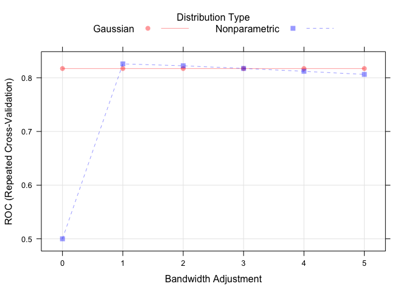
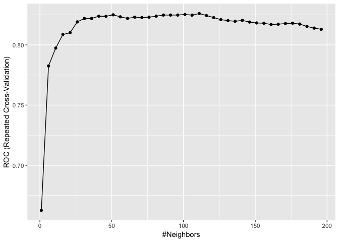
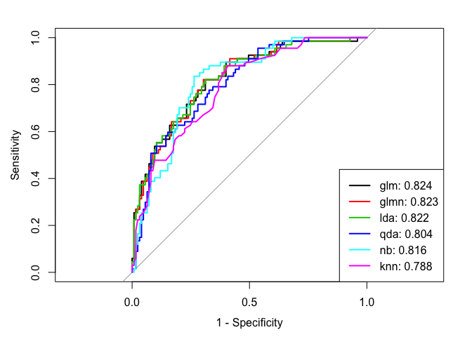

Linear Methods for Classification
================

``` r
library(caret)
library(glmnet)
library(MASS)
library(e1071)
library(mlbench)
library(pROC)
library(AppliedPredictiveModeling)
```

We use the Pima Indians Diabetes Database for illustration. The data contain 768 observations and 9 variables. The outcome is a binary variable `diabetes`. We start from some simple visualization of the data.

``` r
data(PimaIndiansDiabetes)
dat <- PimaIndiansDiabetes

transparentTheme(trans = .4)
featurePlot(x = dat[, 1:8], 
            y = dat$diabetes,
            scales = list(x=list(relation="free"), 
                        y=list(relation="free")),
            plot = "density", pch = "|", 
            auto.key = list(columns = 2))
```



The data is divided into two parts (training and test).

``` r
set.seed(1)
rowTrain <- createDataPartition(y = dat$diabetes,
                                p = 0.75,
                                list = FALSE)
```

Logistic regression
-------------------

``` r
glm.fit <- glm(diabetes~., 
               data = dat, 
               subset = rowTrain, 
               family = binomial)

contrasts(dat$diabetes)
```

    ##     pos
    ## neg   0
    ## pos   1

We first consider the Bayes classifier (cutoff 0.5) and evaluate its performance on the test data.

``` r
test.pred.prob  <- predict(glm.fit, newdata = dat[-rowTrain,],
                           type = "response")
test.pred <- rep("neg", length(test.pred.prob))
test.pred[test.pred.prob>0.5] <- "pos"


# confusionMatrix(data = as.factor(test.pred),
#                 reference = dat$diabetes[-rowTrain])

confusionMatrix(data = as.factor(test.pred),
                reference = dat$diabetes[-rowTrain],
                positive = "pos")
```

    ## Confusion Matrix and Statistics
    ## 
    ##           Reference
    ## Prediction neg pos
    ##        neg 105  27
    ##        pos  20  40
    ##                                           
    ##                Accuracy : 0.7552          
    ##                  95% CI : (0.6881, 0.8143)
    ##     No Information Rate : 0.651           
    ##     P-Value [Acc > NIR] : 0.001235        
    ##                                           
    ##                   Kappa : 0.4479          
    ##  Mcnemar's Test P-Value : 0.381471        
    ##                                           
    ##             Sensitivity : 0.5970          
    ##             Specificity : 0.8400          
    ##          Pos Pred Value : 0.6667          
    ##          Neg Pred Value : 0.7955          
    ##              Prevalence : 0.3490          
    ##          Detection Rate : 0.2083          
    ##    Detection Prevalence : 0.3125          
    ##       Balanced Accuracy : 0.7185          
    ##                                           
    ##        'Positive' Class : pos             
    ## 

We then plot the test ROC curve. You may (or may not) also consider to add a smoothed ROC curve.

``` r
roc.glm <- roc(dat$diabetes[-rowTrain], test.pred.prob)
plot(roc.glm, legacy.axes = TRUE, print.auc = TRUE)
plot(smooth(roc.glm), col = 4, add = TRUE)
```



We can also fit a logistic regression using caret. This is to compare the cross-valiation performance with other models, rather than tuning the model.

``` r
# Using caret
ctrl <- trainControl(method = "repeatedcv",
                     repeats = 5,
                     summaryFunction = twoClassSummary,
                     classProbs = TRUE)
set.seed(1)
model.glm <- train(x = dat[rowTrain,1:8],
                   y = dat$diabetes[rowTrain],
                   method = "glm",
                   metric = "ROC",
                   trControl = ctrl)
```

Regularized logistic regression can be fitted using `glmnet'. We use the`train\` function to select the optimal tuning parameters.

``` r
glmnGrid <- expand.grid(.alpha = seq(0, 1, length = 6),
                        .lambda = exp(seq(-6, -2, length = 20)))
set.seed(1)
model.glmn <- train(x = dat[rowTrain,1:8],
                    y = dat$diabetes[rowTrain],
                    method = "glmnet",
                    tuneGrid = glmnGrid,
                    metric = "ROC",
                    trControl = ctrl)

plot(model.glmn, xTrans = function(x) log(x))   
```



Discriminant analysis
---------------------

### LDA

We use the function `lda` in library `MASS` to conduct LDA.

``` r
library(MASS)

lda.fit <- lda(diabetes~., data = dat,
               subset = rowTrain)
plot(lda.fit)
```



Evaluate the test set performance using ROC.

``` r
lda.pred <- predict(lda.fit, newdata = dat[-rowTrain,])
head(lda.pred$posterior)
```

    ##          neg        pos
    ## 2  0.9585326 0.04146742
    ## 4  0.9606576 0.03934240
    ## 6  0.8568827 0.14311728
    ## 8  0.3108727 0.68912729
    ## 10 0.9628021 0.03719790
    ## 11 0.7919396 0.20806038

``` r
roc.lda <- roc(dat$diabetes[-rowTrain], lda.pred$posterior[,2], 
               levels = c("neg", "pos"))

plot(roc.lda, legacy.axes = TRUE, print.auc = TRUE)
```



Using caret:

``` r
set.seed(1)
model.lda <- train(x = dat[rowTrain,1:8],
                   y = dat$diabetes[rowTrain],
                   method = "lda",
                   metric = "ROC",
                   trControl = ctrl)
```

### QDA

``` r
set.seed(1)
model.qda <- train(x = dat[rowTrain,1:8],
                   y = dat$diabetes[rowTrain],
                   method = "qda",
                   metric = "ROC",
                   trControl = ctrl)

# use qda() in MASS
qda.fit <- qda(diabetes~., data = dat,
               subset = rowTrain)

qda.pred <- predict(qda.fit, newdata = dat[-rowTrain,])
head(qda.pred$posterior)
```

    ##            neg         pos
    ## 2  0.986980464 0.013019536
    ## 4  0.993594734 0.006405266
    ## 6  0.945182664 0.054817336
    ## 8  0.001555342 0.998444658
    ## 10 0.919436486 0.080563514
    ## 11 0.820482469 0.179517531

### Naive Bayes

``` r
set.seed(1)

nbGrid <- expand.grid(usekernel = c(FALSE,TRUE),
                      fL = 1, 
                      adjust = seq(0,5,by = 1))

model.nb <- train(x = dat[rowTrain,1:8],
                  y = dat$diabetes[rowTrain],
                  method = "nb",
                  tuneGrid = nbGrid,
                  metric = "ROC",
                  trControl = ctrl)

plot(model.nb)
```



### KNN

``` r
set.seed(1)

model.knn <- train(x = dat[rowTrain,1:8],
                   y = dat$diabetes[rowTrain],
                   method = "knn",
                   preProcess = c("center","scale"),
                   tuneGrid = data.frame(k = seq(1,200,by=5)),
                   trControl = ctrl)

ggplot(model.knn)
```



predict.train(model.knn) - this function will automatically do preprocessing.

GLM, Regularized GLM and LDA have relatively good performance.

``` r
res <- resamples(list(GLM = model.glm, GLMNET = model.glmn, 
                      LDA = model.lda, QDA = model.qda,
                      NB = model.nb, KNN = model.knn))
summary(res)
```

    ## 
    ## Call:
    ## summary.resamples(object = res)
    ## 
    ## Models: GLM, GLMNET, LDA, QDA, NB, KNN 
    ## Number of resamples: 50 
    ## 
    ## ROC 
    ##             Min.   1st Qu.    Median      Mean   3rd Qu.      Max. NA's
    ## GLM    0.7105263 0.8024906 0.8243421 0.8296935 0.8655583 0.9210526    0
    ## GLMNET 0.7230576 0.8047949 0.8266409 0.8316465 0.8629090 0.9236842    0
    ## LDA    0.7205514 0.8079481 0.8299964 0.8323343 0.8655583 0.9263158    0
    ## QDA    0.6917293 0.7733108 0.8046586 0.8086373 0.8434211 0.9263158    0
    ## NB     0.7000000 0.7969595 0.8273471 0.8259125 0.8601974 0.9421053    0
    ## KNN    0.7317568 0.7878378 0.8312500 0.8260247 0.8550896 0.9328947    0
    ## 
    ## Sens 
    ##             Min.   1st Qu.    Median      Mean   3rd Qu.     Max. NA's
    ## GLM    0.7567568 0.8648649 0.8684211 0.8783215 0.8947368 1.000000    0
    ## GLMNET 0.7631579 0.8648649 0.8918919 0.8889758 0.9210526 1.000000    0
    ## LDA    0.7567568 0.8648649 0.8684211 0.8766856 0.8947368 1.000000    0
    ## QDA    0.7027027 0.8108108 0.8421053 0.8414367 0.8684211 0.972973    0
    ## NB     0.6756757 0.8213016 0.8648649 0.8553201 0.8918919 0.972973    0
    ## KNN    0.9189189 0.9473684 0.9729730 0.9722048 1.0000000 1.000000    0
    ## 
    ## Spec 
    ##             Min.   1st Qu.    Median      Mean   3rd Qu.      Max. NA's
    ## GLM    0.3809524 0.5500000 0.5500000 0.5740476 0.6500000 0.8000000    0
    ## GLMNET 0.3809524 0.5000000 0.5500000 0.5482857 0.6000000 0.7500000    0
    ## LDA    0.3809524 0.5125000 0.5500000 0.5690476 0.6500000 0.7500000    0
    ## QDA    0.2500000 0.4821429 0.5500000 0.5434286 0.6000000 0.7500000    0
    ## NB     0.3809524 0.5500000 0.6000000 0.6120476 0.6916667 0.8000000    0
    ## KNN    0.1000000 0.2000000 0.2678571 0.2691905 0.3500000 0.5238095    0

Now let's look at the test set performance.

``` r
lda.pred <- predict(model.lda, newdata = dat[-rowTrain,], type = "prob")[,2]
glm.pred <- predict(model.glm, newdata = dat[-rowTrain,], type = "prob")[,2]
glmn.pred <- predict(model.glmn, newdata = dat[-rowTrain,], type = "prob")[,2]
nb.pred <- predict(model.nb, newdata = dat[-rowTrain,], type = "prob")[,2]
qda.pred <- predict(model.qda, newdata = dat[-rowTrain,], type = "prob")[,2]
knn.pred <- predict(model.knn, newdata = dat[-rowTrain,], type = "prob")[,2]


roc.lda <- roc(dat$diabetes[-rowTrain], lda.pred)
roc.glm <- roc(dat$diabetes[-rowTrain], glm.pred)
roc.glmn <- roc(dat$diabetes[-rowTrain], glmn.pred)
roc.nb <- roc(dat$diabetes[-rowTrain], nb.pred)
roc.qda <- roc(dat$diabetes[-rowTrain], qda.pred)
roc.knn <- roc(dat$diabetes[-rowTrain], knn.pred)

auc <- c(roc.glm$auc[1], roc.glmn$auc[1], roc.lda$auc[1],
         roc.qda$auc[1], roc.nb$auc[1], roc.knn$auc[1])

plot(roc.glm, legacy.axes = TRUE)
plot(roc.glmn, col = 2, add = TRUE)
plot(roc.lda, col = 3, add = TRUE)
plot(roc.qda, col = 4, add = TRUE)
plot(roc.nb, col = 5, add = TRUE)
plot(roc.knn, col = 6, add = TRUE)
modelNames <- c("glm","glmn","lda","qda","nb","knn")
legend("bottomright", legend = paste0(modelNames, ": ", round(auc,3)),
       col = 1:6, lwd = 2)
```


