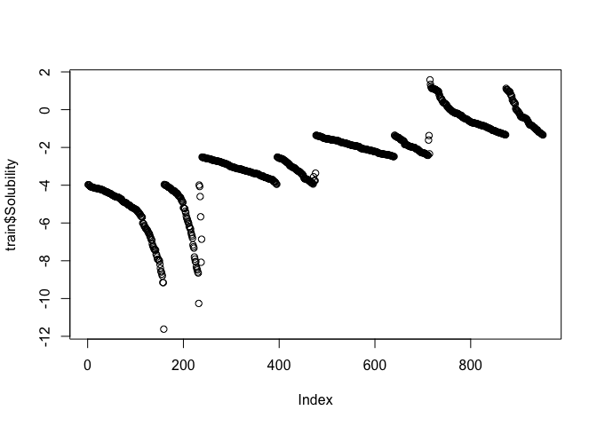
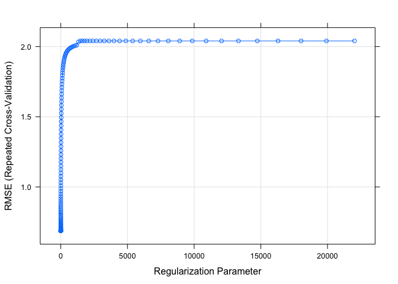
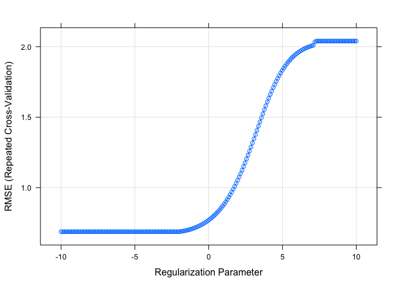
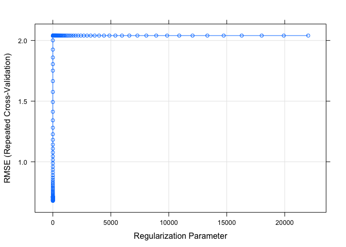
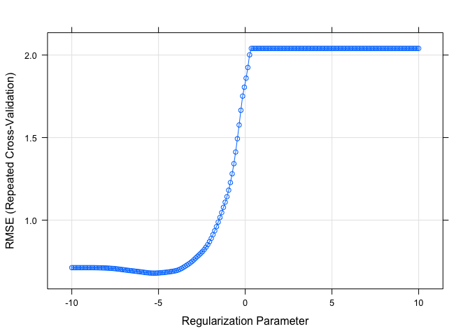
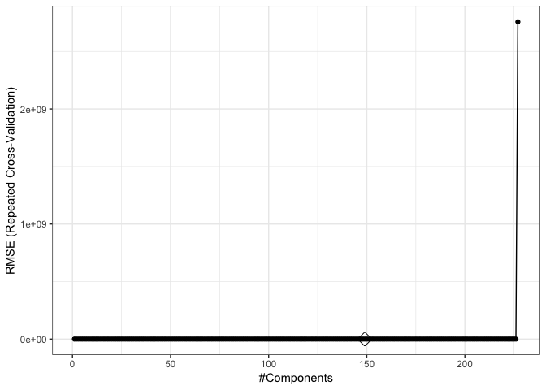
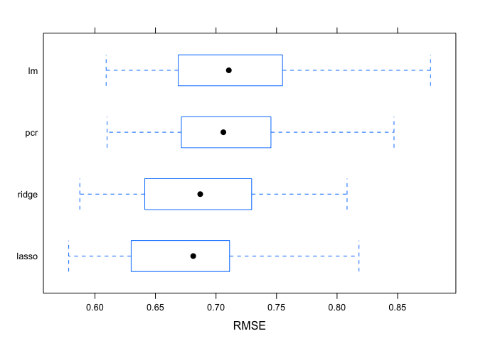

Homework 1
================
Amin Yakubu
2/23/2019

``` r
library(tidyverse)
library(glmnet)
library(caret)
library(corrplot)
library(plotmo)
library(pls)
```

Data
====

``` r
train = read_csv('./data/solubility_train.csv')
test = read_csv('./data/solubility_test.csv')
```

The data has been divided into training and testing. The testing data has 951 observations and the test data has 356 observations. There are 229 predictors. 208 are binary variables that indicate the presence or absence of a particular chemical substructure, 16 are count descriptors, such as the number of bonds or the number of bromine atoms, and 4 are continuous descriptors, such as molecular weight or surface area. The response is in the column `Solubility` which is a continuous variable

``` r
# Checking for missing values
missing_train <- sapply(train, function(x) sum(is.na(x)))
missing_train[missing_train > 0]
```

    ## named integer(0)

``` r
missing_test <- sapply(test, function(x) sum(is.na(x)))
missing_test[missing_test > 0]
```

    ## named integer(0)

No missing data

``` r
plot(train$Solubility)
```



Data processing

``` r
#Training set
X.train = model.matrix(Solubility ~ ., train)[,-1]
y.train = train$Solubility

#Testing set
X.test = model.matrix(Solubility ~ ., test)[,-1]
y.test = test$Solubility

ctrl1 <- trainControl(method = "repeatedcv", number = 10, repeats = 5)
```

Question 1 -- Linear Model
--------------------------

``` r
set.seed(2)
lm.fit <- train(X.train, y.train,
                method = "lm",
                trControl = ctrl1)

pred.lm <- predict(lm.fit$finalModel, newdata = data.frame(X.test))

mean((pred.lm - y.test)^2)
```

    ## [1] 0.5558898

Question 2 -- Ridge Regression
------------------------------

``` r
set.seed(2)
ridge.fit <- train(X.train, y.train,
                     method = "glmnet",
                     tuneGrid = expand.grid(alpha = 0, 
                                            lambda = exp(seq(-10, 10, length = 200))),
                     trControl = ctrl1)

plot(ridge.fit)
```



``` r
plot(ridge.fit, xTrans = function(x) log(x)) # here were are plotting log lambda so it looks like the previous plots
```



``` r
ridge.fit$bestTune
```

    ##    alpha    lambda
    ## 80     0 0.1274155

``` r
bestlam.ridge = ridge.fit$bestTune$lambda
bestlam.ridge
```

    ## [1] 0.1274155

``` r
ridge.pred = predict(ridge.fit$finalModel, s = bestlam.ridge, newx = X.test)
mean((ridge.pred - y.test)^2)
```

    ## [1] 0.5134603

The mean test error is 0.51346

Question 3 -- The Lasso
-----------------------

``` r
set.seed(2)
lasso.fit <- train(X.train, y.train,
                     method = "glmnet",
                     tuneGrid = expand.grid(alpha = 1, 
                                            lambda = exp(seq(-10,10, length = 200))),
                     trControl = ctrl1)

plot(lasso.fit)
```



``` r
plot(lasso.fit, xTrans = function(x) log(x)) # here were are plotting log lambda so it looks like the previous plots
```



``` r
bestlam.lasso = lasso.fit$bestTune$lambda
bestlam.lasso
```

    ## [1] 0.005110889

``` r
lasso.pred = predict(lasso.fit$finalModel, s = bestlam.lasso, newx = X.test)
mean((lasso.pred - y.test)^2)
```

    ## [1] 0.4963234

The mean error is 0.4987.

``` r
lasso.coef = predict(lasso.fit$finalModel, type = "coefficients", s = bestlam.lasso)[1:ncol(train),]
length(lasso.coef)
```

    ## [1] 229

``` r
length(lasso.coef[lasso.coef != 0])
```

    ## [1] 144

There are 144 non-zero coefficient

Question 4 -- PCR
-----------------

``` r
set.seed(2)
pcr.fit <- train(X.train, y.train,
                  method = "pcr",
                  tuneLength = 228,
                  trControl = ctrl1,
                  scale = TRUE)

pred.pcr <- predict(pcr.fit$finalModel, newdata = X.test, 
                       ncomp = pcr.fit$bestTune$ncomp)

mean((pred.pcr - y.test)^2)
```

    ## [1] 0.540555

``` r
ggplot(pcr.fit, highlight = TRUE) + theme_bw()
```



Question 5 -- Discussion

``` r
resamp <- resamples(list(lasso = lasso.fit, 
                         ridge = ridge.fit, 
                         pcr = pcr.fit,
                         lm = lm.fit))
summary(resamp)
```

    ## 
    ## Call:
    ## summary.resamples(object = resamp)
    ## 
    ## Models: lasso, ridge, pcr, lm 
    ## Number of resamples: 50 
    ## 
    ## MAE 
    ##            Min.   1st Qu.    Median      Mean   3rd Qu.      Max. NA's
    ## lasso 0.4358345 0.4852452 0.5201107 0.5186882 0.5409710 0.6036287    0
    ## ridge 0.4496804 0.4940707 0.5233784 0.5242992 0.5580663 0.6004447    0
    ## pcr   0.4696066 0.5185551 0.5448078 0.5441795 0.5711752 0.6393132    0
    ## lm    0.4470475 0.5007241 0.5381286 0.5310430 0.5615846 0.6043591    0
    ## 
    ## RMSE 
    ##            Min.   1st Qu.    Median      Mean   3rd Qu.      Max. NA's
    ## lasso 0.5783339 0.6301845 0.6811869 0.6787085 0.7099573 0.8181034    0
    ## ridge 0.5875062 0.6432311 0.6869788 0.6869960 0.7265436 0.8082616    0
    ## pcr   0.6100096 0.6726117 0.7060811 0.7095926 0.7438545 0.8470371    0
    ## lm    0.6092505 0.6699831 0.7106012 0.7117147 0.7531688 0.8772079    0
    ## 
    ## Rsquared 
    ##            Min.   1st Qu.    Median      Mean   3rd Qu.      Max. NA's
    ## lasso 0.8527973 0.8776698 0.8897130 0.8906161 0.9050896 0.9256949    0
    ## ridge 0.8533529 0.8764841 0.8873173 0.8881426 0.9043198 0.9228772    0
    ## pcr   0.8458710 0.8683380 0.8806705 0.8809669 0.8926659 0.9163149    0
    ## lm    0.8423791 0.8657031 0.8779699 0.8812886 0.9012601 0.9208367    0

``` r
bwplot(resamp, metric = "RMSE")
```


