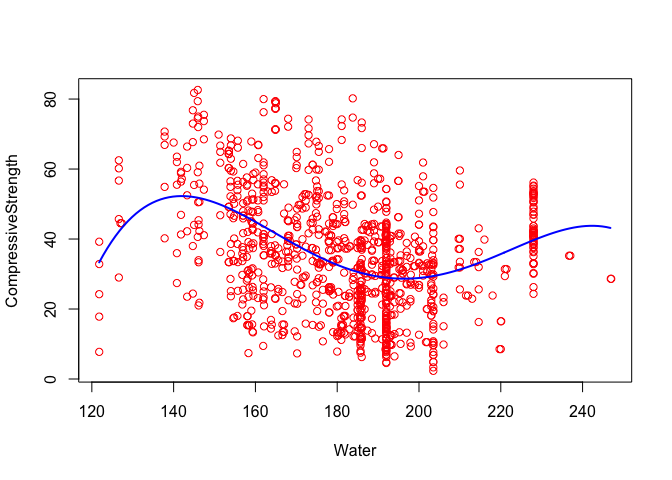
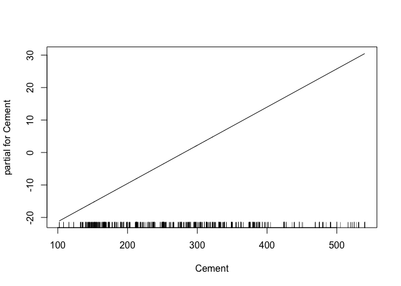
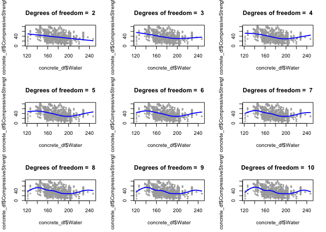
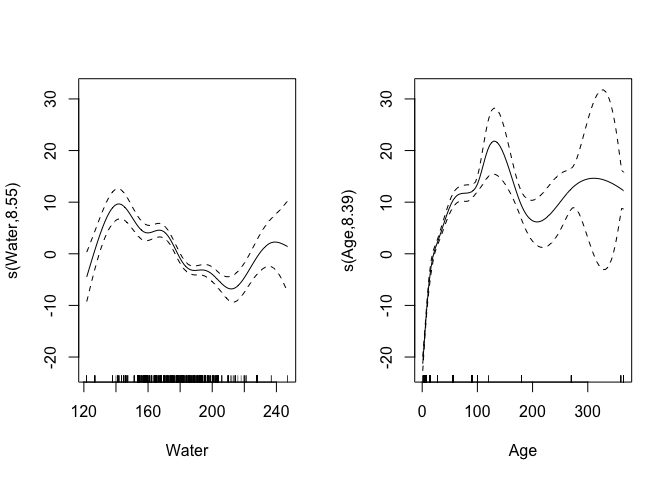

HW2
================
Amin Yakubu
3/16/2019

``` r
library(caret)
library(tidyverse)
library(gam)
library(boot)
library(mgcv)
```

Let's read in the data

``` r
concrete_df = read_csv('data/concrete.csv')
attach(concrete_df)
```

``` r
X = model.matrix(CompressiveStrength ~ ., concrete_df)[,-1]
y = concrete_df$CompressiveStrength
```

Question A
----------

Scatter plots to visualize the distribution of the variables

``` r
theme1 <- trellis.par.get()
theme1$plot.symbol$col <- rgb(.3, .5, .2, .5)
theme1$plot.symbol$pch <- 18
theme1$plot.line$col <- rgb(.8, .1, .1, 1)
theme1$plot.line$lwd <- 2
theme1$strip.background$col <- rgb(.0, .2, .6, .2)
trellis.par.set(theme1)
featurePlot(X, y, plot = "scatter", labels = c("","Y"),
            type = c("p"), layout = c(4, 2))
```


Question B
----------

Here I am using cross-validation to select the optimal degreedforthe polynomial.

``` r
set.seed(1)
deltas <- rep(NA, 5)
for (i in 1:5) {
    fit <- glm(CompressiveStrength ~ poly(Water, i), data = concrete_df)
    deltas[i] <- cv.glm(concrete_df, fit, K = 10)$delta[1]
}

plot(1:5, deltas, xlab = "Degree", ylab = "Test MSE", type = "l")
d.min <- which.min(deltas)
points(which.min(deltas), deltas[which.min(deltas)], col = "red", cex = 2, pch = 20)
```


We see that the optimal d chosen is 4.

Now let's use ANOVA to test the subsets.

``` r
fit1 = lm(CompressiveStrength ~ Water, data = concrete_df)
fit2 = lm(CompressiveStrength ~ poly(Water, 2), data = concrete_df)
fit3 = lm(CompressiveStrength ~ poly(Water, 3), data = concrete_df)
fit4 = lm(CompressiveStrength ~ poly(Water, 4), data = concrete_df)
fit5 = lm(CompressiveStrength ~ poly(Water, 5), data = concrete_df)
```

``` r
anova(fit1, fit2, fit3, fit4, fit5)
```

    ## Analysis of Variance Table
    ## 
    ## Model 1: CompressiveStrength ~ Water
    ## Model 2: CompressiveStrength ~ poly(Water, 2)
    ## Model 3: CompressiveStrength ~ poly(Water, 3)
    ## Model 4: CompressiveStrength ~ poly(Water, 4)
    ## Model 5: CompressiveStrength ~ poly(Water, 5)
    ##   Res.Df    RSS Df Sum of Sq      F    Pr(>F)    
    ## 1   1028 263085                                  
    ## 2   1027 247712  1   15372.8 68.122 4.696e-16 ***
    ## 3   1026 235538  1   12174.0 53.947 4.197e-13 ***
    ## 4   1025 231246  1    4291.5 19.017 1.426e-05 ***
    ## 5   1024 231081  1     165.9  0.735    0.3915    
    ## ---
    ## Signif. codes:  0 '***' 0.001 '**' 0.01 '*' 0.05 '.' 0.1 ' ' 1

Using ANOVA and by examining the p-values we see that degree 4 or 5 polynomial appear to provide a reasonable fit to the data. I will choose the 4 polynomial since we want a parsimonious model.

``` r
plot(CompressiveStrength ~ Water, data = concrete_df, col = "red")

waterlims <- range(concrete_df$Water)
water.grid <- seq(from = waterlims[1], to = waterlims[2], by = 1)

fit <- lm(CompressiveStrength ~ poly(Water, 4), data = concrete_df)

preds <- predict(fit, newdata = data.frame(Water = water.grid))

lines(water.grid, preds, col = "blue", lwd = 2)
```



Question C
----------

Here we are using the generalized cross-validation to choose the degrees of freedom

``` r
fit.ss <- smooth.spline(concrete_df$Water, concrete_df$CompressiveStrength)
fit.ss$df
```

    ## [1] 68.88205

``` r
pred.ss <- predict(fit.ss, x = water.grid)

pred.ss.df <- data.frame(pred = pred.ss$y,
                         water = water.grid)

p <- ggplot(data = concrete_df, aes(x = Water, y = CompressiveStrength)) +
  geom_point(color = rgb(.2, .4, .2, .5))

p + geom_line(aes(x = water, y = pred), data = pred.ss.df, 
              color = rgb(.8, .1, .1, 1)) + theme_bw() + 
  labs(title = paste(round(fit.ss$df), 'degrees of freedom from GCV')) + 
  theme(plot.title = element_text(hjust = 0.5))
```



The chosen degrees of freedom 68.88. This is high and makes the model more wiggly.

Here we will fit for different degrees of freedom for 2 to 10.

``` r
par(mfrow = c(3,3)) # 3 x 3 grid
all.dfs = rep(NA, 9)
for (i in 2:10) {
  fit.ss = smooth.spline(concrete_df$Water, concrete_df$CompressiveStrength, df = i)
  
  pred.ss <- predict(fit.ss, x = water.grid)
  
  plot(concrete_df$Water, concrete_df$CompressiveStrength, cex = .5, col = "darkgrey")
  title(paste("Degrees of freedom = ", round(fit.ss$df)),  outer = F)
  lines(water.grid, pred.ss$y, lwd = 2, col = "blue")
}
```



Question D
----------

Here I will find a GAM using all the predictors

``` r
gam.m1 = mgcv::gam(CompressiveStrength ~ Cement + BlastFurnaceSlag + FlyAsh + s(Water) + Superplasticizer + CoarseAggregate + FineAggregate + s(Age), data = concrete_df)

par(mfrow = c(1,2))
plot(gam.m1)
```



``` r
gam.m2 = mgcv::gam(CompressiveStrength ~ Cement + BlastFurnaceSlag + FlyAsh + Water + Superplasticizer + CoarseAggregate + FineAggregate + Age, data = concrete_df)

anova(gam.m1, gam.m2, test = 'F')
```

    ## Analysis of Deviance Table
    ## 
    ## Model 1: CompressiveStrength ~ Cement + BlastFurnaceSlag + FlyAsh + s(Water) + 
    ##     Superplasticizer + CoarseAggregate + FineAggregate + s(Age)
    ## Model 2: CompressiveStrength ~ Cement + BlastFurnaceSlag + FlyAsh + Water + 
    ##     Superplasticizer + CoarseAggregate + FineAggregate + Age
    ##   Resid. Df Resid. Dev      Df Deviance      F    Pr(>F)    
    ## 1    1005.2      43122                                      
    ## 2    1021.0     110413 -15.757   -67291 99.632 < 2.2e-16 ***
    ## ---
    ## Signif. codes:  0 '***' 0.001 '**' 0.01 '*' 0.05 '.' 0.1 ' ' 1

According the p-value the anova, non linear model is better.
