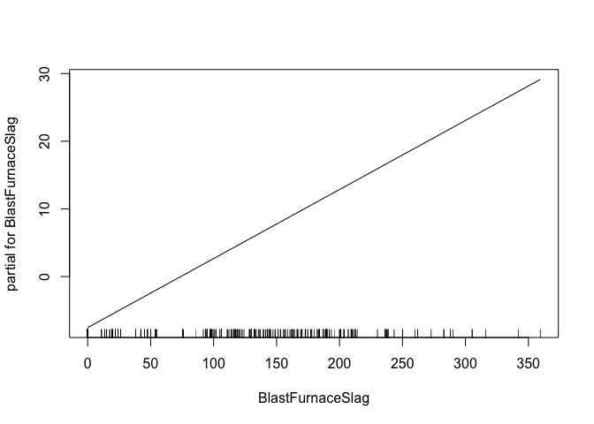
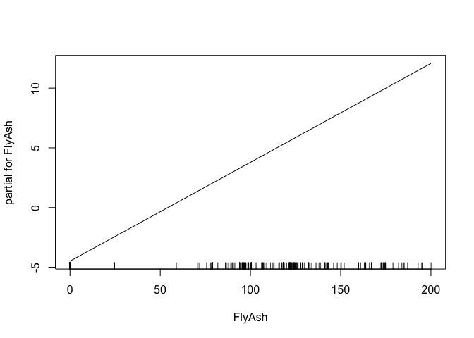
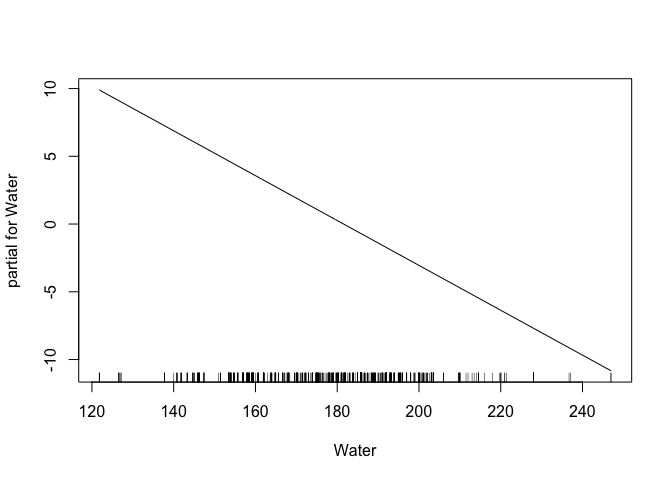
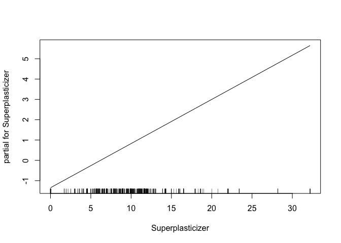
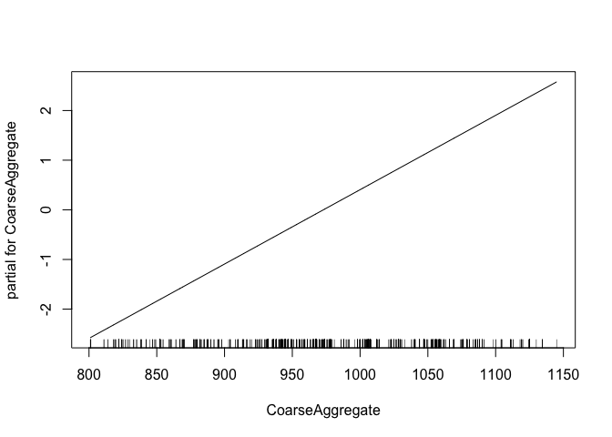
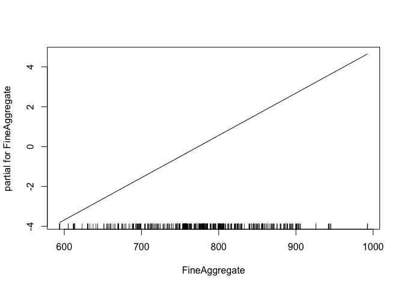
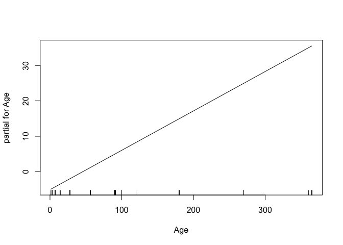
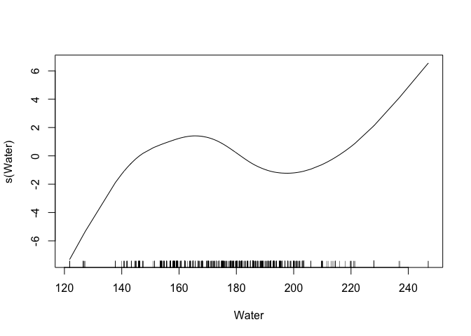

HW2
================
Amin Yakubu
3/16/2019

``` r
library(caret)
```

    ## Loading required package: lattice

    ## Loading required package: ggplot2

``` r
library(tidyverse)
```

    ## ── Attaching packages ──────────────────────────────────────────────────────────────────────────────────────── tidyverse 1.2.1 ──

    ## ✔ tibble  2.0.1       ✔ purrr   0.2.5  
    ## ✔ tidyr   0.8.1       ✔ dplyr   0.8.0.1
    ## ✔ readr   1.1.1       ✔ stringr 1.4.0  
    ## ✔ tibble  2.0.1       ✔ forcats 0.3.0

    ## ── Conflicts ─────────────────────────────────────────────────────────────────────────────────────────── tidyverse_conflicts() ──
    ## ✖ dplyr::filter() masks stats::filter()
    ## ✖ dplyr::lag()    masks stats::lag()
    ## ✖ purrr::lift()   masks caret::lift()

``` r
library(gam)
```

    ## Loading required package: splines

    ## Loading required package: foreach

    ## 
    ## Attaching package: 'foreach'

    ## The following objects are masked from 'package:purrr':
    ## 
    ##     accumulate, when

    ## Loaded gam 1.16

Let's read in the data

``` r
concrete_df = read_csv('data/concrete.csv')
```

    ## Parsed with column specification:
    ## cols(
    ##   Cement = col_double(),
    ##   BlastFurnaceSlag = col_double(),
    ##   FlyAsh = col_double(),
    ##   Water = col_double(),
    ##   Superplasticizer = col_double(),
    ##   CoarseAggregate = col_double(),
    ##   FineAggregate = col_double(),
    ##   Age = col_integer(),
    ##   CompressiveStrength = col_double()
    ## )

``` r
attach(concrete_df)
```

``` r
X = model.matrix(CompressiveStrength ~ ., concrete_df)[,-1]
y = concrete_df$CompressiveStrength
```

Scatter plots
-------------

``` r
theme1 <- trellis.par.get()
theme1$plot.symbol$col <- rgb(.3, .5, .2, .5)
theme1$plot.symbol$pch <- 18
theme1$plot.line$col <- rgb(.8, .1, .1, 1)
theme1$plot.line$lwd <- 2
theme1$strip.background$col <- rgb(.0, .2, .6, .2)
trellis.par.set(theme1)
featurePlot(X, y, plot = "scatter", labels = c("","Y"),
            type = c("p"), layout = c(4, 2))
```


``` r
fit1 = lm(CompressiveStrength ~ Water, data = concrete_df)
fit2 = lm(CompressiveStrength ~ poly(Water, 2), data = concrete_df)
fit3 = lm(CompressiveStrength ~ poly(Water, 3), data = concrete_df)
fit4 = lm(CompressiveStrength ~ poly(Water, 4), data = concrete_df)
```

``` r
anova(fit1, fit2, fit3, fit4)
```

    ## Analysis of Variance Table
    ## 
    ## Model 1: CompressiveStrength ~ Water
    ## Model 2: CompressiveStrength ~ poly(Water, 2)
    ## Model 3: CompressiveStrength ~ poly(Water, 3)
    ## Model 4: CompressiveStrength ~ poly(Water, 4)
    ##   Res.Df    RSS Df Sum of Sq      F    Pr(>F)    
    ## 1   1028 263085                                  
    ## 2   1027 247712  1   15372.8 68.140 4.652e-16 ***
    ## 3   1026 235538  1   12174.0 53.962 4.166e-13 ***
    ## 4   1025 231246  1    4291.5 19.022 1.423e-05 ***
    ## ---
    ## Signif. codes:  0 '***' 0.001 '**' 0.01 '*' 0.05 '.' 0.1 ' ' 1

Question 2

``` r
fit.ss.cv <- smooth.spline(concrete_df$Water, concrete_df$CompressiveStrength, cv = TRUE)
```

    ## Warning in smooth.spline(concrete_df$Water,
    ## concrete_df$CompressiveStrength, : cross-validation with non-unique 'x'
    ## values seems doubtful

``` r
fit.ss.cv$df
```

    ## [1] 8.04468

``` r
fit.ss <- smooth.spline(concrete_df$Water, concrete_df$CompressiveStrength)
fit.ss$df
```

    ## [1] 68.88205

``` r
water_lims <- range(concrete_df$Water)
water.grid <- seq(from = water_lims[1], to = water_lims[2])
```

``` r
gam.m1 <- gam(CompressiveStrength ~ . + s(Water), data = concrete_df)
plot(gam.m1)
```


